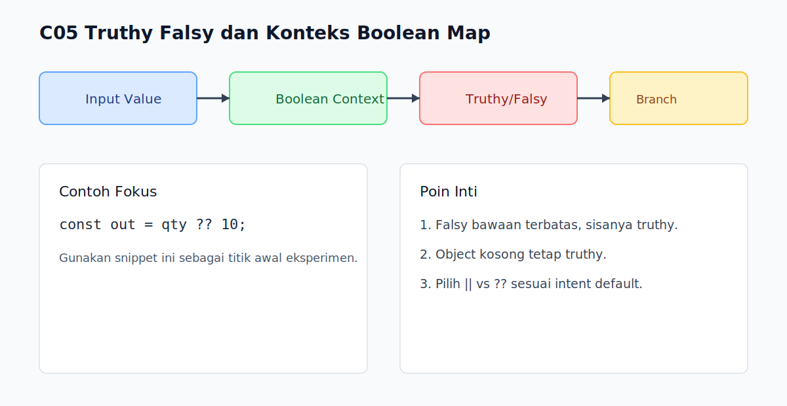

# C05 - Truthy Falsy dan Konteks Boolean

## Tujuan

Bab ini bertujuan memahami bagaimana JavaScript mengevaluasi nilai dalam konteks boolean.

## Kenapa Bab Ini Penting

Banyak logika `if`, `while`, dan short-circuit memakai coercion boolean implicit.

Salah paham truthy/falsy bisa membuat cabang logika berjalan tidak sesuai ekspektasi.

## Konsep Inti

### 1. Nilai Falsy Bawaan

Nilai falsy yang perlu dihafal:

- `false`
- `0`
- `-0`
- `0n`
- `''` (string kosong)
- `null`
- `undefined`
- `NaN`

Selain daftar ini, nilai lain bersifat truthy.

### 2. Object Selalu Truthy

```js
if ([]) {
  console.log('array kosong tetap truthy');
}

if ({}) {
  console.log('object kosong tetap truthy');
}
```

### 3. Boolean Context Umum

- kondisi `if` / `else`
- operator `&&` dan `||`
- operator negasi `!`

```js
const name = '';
const fallback = name || 'Anonymous';
console.log(fallback); // Anonymous
```

## Praktik yang Direkomendasikan

- Gunakan cek eksplisit saat nilai `0` atau `''` dianggap valid.
- Pisahkan konsep "kosong" dan "tidak ada" saat mendesain validasi.
- Tulis kondisi yang mudah dibaca, bukan kondisi singkat tapi ambigu.

## Kesalahan Umum

- Menganggap `[]` dan `{}` adalah falsy karena "kosong".
- Memakai `||` untuk default saat `0` harus tetap dipertahankan.
- Menumpuk `!` berlebihan (`!!!value`) yang menurunkan keterbacaan.

## Checkpoint Cepat

1. Sebutkan 8 nilai falsy bawaan JavaScript.
2. Kenapa `if ([])` tetap masuk blok?
3. Kapan `??` lebih aman daripada `||`?

## Ringkasan

- JavaScript memiliki daftar falsy yang terbatas.
- Nilai selain daftar tersebut adalah truthy.
- Konteks boolean perlu desain kondisi yang eksplisit.

## Visual Map



## Contoh Runnable

- Lihat contoh: `../examples/C05-truthy-falsy-dan-konteks-boolean/example.js`
- Panduan: `../examples/C05-truthy-falsy-dan-konteks-boolean/README.md`


