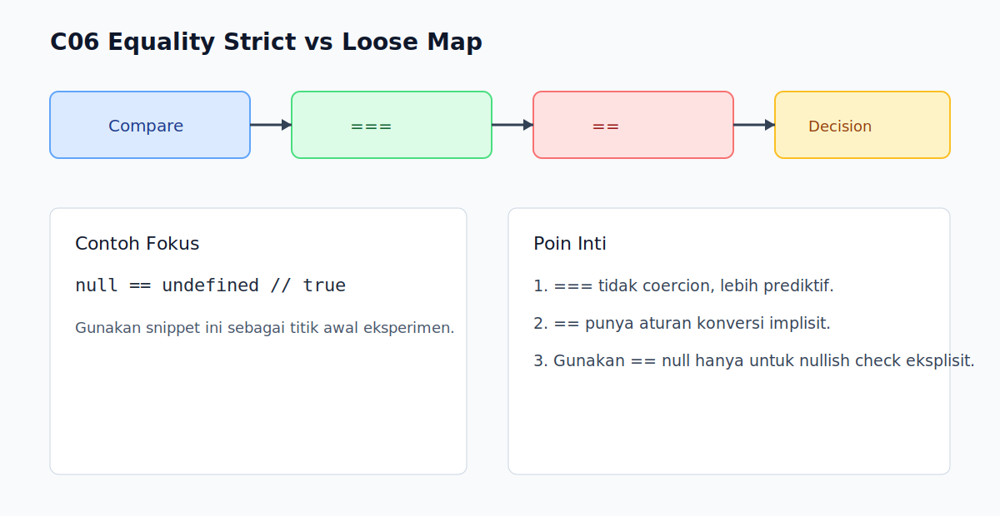

# C06 - Equality Strict vs Loose

## Tujuan

Bab ini bertujuan membedakan perilaku `===` dan `==` secara praktis.

## Kenapa Bab Ini Penting

Bug comparison sering muncul karena coercion implicit pada loose equality.

Memilih operator yang tepat membuat intent kode lebih jelas dan aman.

## Konsep Inti

### 1. `===` Tidak Melakukan Type Coercion

```js
console.log(5 === '5'); // false
console.log(0 === false); // false
```

`===` membandingkan nilai dan tipe sekaligus.

### 2. `==` Dapat Melakukan Coercion

```js
console.log(5 == '5'); // true
console.log(0 == false); // true
```

Hasil ini bisa membantu, tapi juga sering menimbulkan kebingungan.

### 3. Kasus Khusus yang Perlu Diingat

```js
console.log(null == undefined);  // true
console.log(null === undefined); // false
console.log(NaN === NaN);        // false
```

`NaN` tidak setara dengan dirinya sendiri.

### 4. Panduan Praktis Penggunaan

- default: gunakan `===` dan `!==`
- pengecualian terbatas: `value == null` untuk cek `null` atau `undefined` sekaligus

## Praktik yang Direkomendasikan

- Jadikan `===` sebagai default coding style tim.
- Pakai `== null` hanya saat intent memang "nullish check".
- Tambahkan test untuk edge case comparison penting.

## Kesalahan Umum

- Memakai `==` tanpa memahami aturan coercion.
- Mengira `NaN === NaN` akan `true`.
- Menganggap object dengan isi sama otomatis sama.

## Checkpoint Cepat

1. Kapan `===` harus jadi pilihan utama?
2. Kenapa `null == undefined` bernilai `true`?
3. Bagaimana cara benar mengecek `NaN`?

## Ringkasan

- `===` membandingkan tanpa coercion dan lebih prediktif.
- `==` melakukan coercion dengan aturan khusus.
- Pahami edge case sebelum memakai loose equality.

## Visual Map



## Contoh Runnable

- Lihat contoh: `../examples/C06-equality-strict-vs-loose/example.js`
- Panduan: `../examples/C06-equality-strict-vs-loose/README.md`


