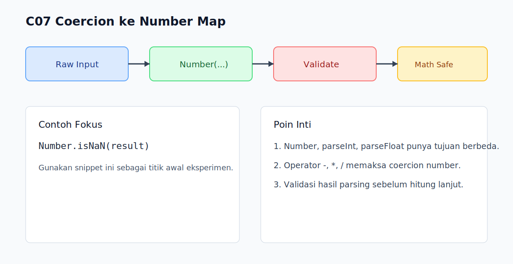

# C07 - Coercion ke Number

## Tujuan

Bab ini bertujuan memahami konversi nilai ke `number`, baik eksplisit maupun implicit.

## Kenapa Bab Ini Penting

Operasi matematika, parsing input, dan validasi angka sangat sering bergantung pada coercion ke number.

Kesalahan memahami aturan konversi bisa menghasilkan `NaN` atau nilai yang tampak benar padahal salah konteks.

## Konsep Inti

### 1. Konversi Eksplisit ke Number

```js
console.log(Number('42'));   // 42
console.log(Number(''));     // 0
console.log(Number('12px')); // NaN
```

### 2. Konversi Implicit pada Operator Numerik

```js
console.log('8' - 3); // 5
console.log('8' * 2); // 16
console.log('8' / 2); // 4
```

Operator ini mendorong operand menjadi number.

### 3. Bedakan `Number`, `parseInt`, `parseFloat`

```js
console.log(Number('10.5px'));   // NaN
console.log(parseInt('10.5px')); // 10
console.log(parseFloat('10.5px')); // 10.5
```

`parseInt/parseFloat` membaca bagian awal string yang valid sebagai angka.

### 4. Validasi Hasil Konversi

```js
const value = Number('abc');
console.log(Number.isNaN(value)); // true
```

Selalu verifikasi hasil jika sumber data berasal dari input user.

## Praktik yang Direkomendasikan

- Gunakan `Number(...)` untuk konversi tegas seluruh string.
- Gunakan `Number.isNaN(...)` untuk validasi kegagalan parsing.
- Tetapkan aturan parsing input secara konsisten di aplikasi.

## Kesalahan Umum

- Menganggap `Number('')` menghasilkan `NaN` (sebenarnya `0`).
- Memakai `parseInt` tanpa basis saat parsing angka non-desimal.
- Tidak mengecek `NaN` sebelum lanjut perhitungan.

## Checkpoint Cepat

1. Apa beda `Number('10px')` dan `parseInt('10px')`?
2. Kenapa `Number('')` menghasilkan `0`?
3. Cara paling aman mengecek hasil konversi gagal apa?

## Ringkasan

- Coercion ke number bisa eksplisit atau implicit.
- `Number`, `parseInt`, dan `parseFloat` punya perilaku berbeda.
- Validasi `NaN` wajib pada data dari sumber eksternal.

## Visual Map



## Contoh Runnable

- Lihat contoh: `../examples/C07-coercion-ke-number/example.js`
- Panduan: `../examples/C07-coercion-ke-number/README.md`


