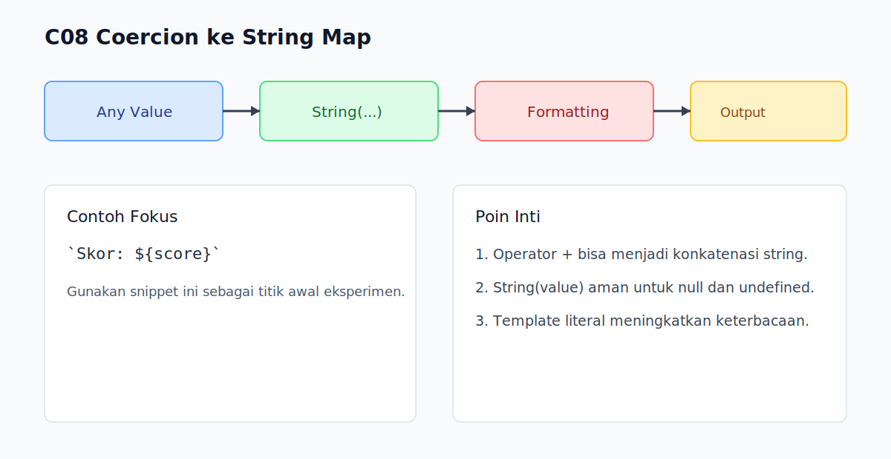

# C08 - Coercion ke String

## Tujuan

Bab ini bertujuan memahami cara nilai dikonversi menjadi string dan dampaknya pada output program.

## Kenapa Bab Ini Penting

String coercion sering muncul saat logging, rendering UI, serialisasi sederhana, dan operator `+`.

Jika tidak dipahami, hasil gabungan nilai bisa membingungkan.

## Konsep Inti

### 1. Konversi Eksplisit ke String

```js
console.log(String(42));      // "42"
console.log(String(null));    // "null"
console.log(String(undefined)); // "undefined"
```

### 2. Operator `+` Bisa Menjadi Konkatenasi

```js
console.log('Nilai: ' + 10); // "Nilai: 10"
console.log(10 + '5');       // "105"
```

Jika salah satu operand string, hasil cenderung string.

### 3. Template Literal untuk String Interpolation

```js
const score = 88;
console.log(`Skor akhir: ${score}`); // "Skor akhir: 88"
```

Template literal umumnya lebih jelas daripada rantai `+` panjang.

### 4. `toString()` Tidak Aman untuk `null`/`undefined`

```js
console.log((42).toString()); // "42"
// null.toString();           // TypeError
```

Gunakan `String(value)` jika nilai bisa nullish.

## Praktik yang Direkomendasikan

- Pilih template literal untuk keterbacaan.
- Gunakan `String(value)` untuk konversi defensif.
- Hindari mixing operasi aritmetika dan konkatenasi dalam satu ekspresi rumit.

## Kesalahan Umum

- Menganggap `+` selalu operasi matematika.
- Memanggil `.toString()` pada nilai yang mungkin `null`.
- Menulis ekspresi campuran tanpa tanda kurung yang jelas.

## Checkpoint Cepat

1. Kapan `+` menjadi konkatenasi string?
2. Kenapa `String(value)` lebih aman dari `value.toString()`?
3. Apa keuntungan template literal dalam code review?

## Ringkasan

- Coercion ke string sering terjadi otomatis melalui `+`.
- `String(...)` memberi konversi eksplisit yang aman.
- Template literal membantu kode lebih jelas dan minim bug format.

## Spec Coverage

Bab ini terutama selaras dengan section ECMAScript berikut:

- `7.1.1`
- `7.1.1.1`
- `7.1.17`
- `7.1.19`

Referensi mapping penuh: `../docs/spec-mapping-56.md`.

## Visual Map



## Contoh Runnable

- Lihat contoh: `../examples/C08-coercion-ke-string/example.js`
- Panduan: `../examples/C08-coercion-ke-string/README.md`
