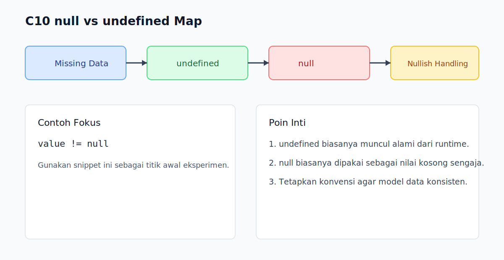

# C10 - null vs undefined

## Tujuan

Bab ini bertujuan membedakan peran `null` dan `undefined` dalam desain data dan flow program.

## Kenapa Bab Ini Penting

Kedua nilai ini terlihat mirip tetapi makna dan asal kemunculannya berbeda.

Menyamakan keduanya tanpa aturan membuat debugging menjadi lambat dan rawan bug.

## Konsep Inti

### 1. `undefined`: Belum Ada Nilai

Kasus umum:

- variabel dideklarasi tanpa assignment
- properti object yang tidak ada
- parameter fungsi yang tidak dikirim

```js
let token;
console.log(token); // undefined
```

### 2. `null`: Sengaja Mengosongkan Nilai

```js
const session = {
  user: null,
};
```

`null` biasanya menandakan nilai "secara sengaja tidak ada".

### 3. Pola Perbandingan Penting

```js
console.log(null == undefined);  // true
console.log(null === undefined); // false
```

Gunakan strict equality jika ingin beda yang tegas.

### 4. Nullish Check dalam Praktik

```js
function hasValue(value) {
  return value != null;
}
```

Pola `value != null` dipakai untuk mengecek bukan `null` dan bukan `undefined` sekaligus.

## Praktik yang Direkomendasikan

- Tetapkan konvensi kapan pakai `null` dalam model data.
- Biarkan `undefined` mewakili "belum di-set" secara natural.
- Gunakan `??` untuk fallback nilai nullish.

## Kesalahan Umum

- Mencampur `null` dan `undefined` tanpa aturan domain.
- Memakai `||` sebagai fallback ketika `0` atau `''` valid.
- Menghapus properti dengan `obj.key = undefined` padahal intent-nya beda.

## Checkpoint Cepat

1. Sebutkan sumber umum munculnya `undefined`.
2. Kapan `null` lebih tepat daripada `undefined`?
3. Kenapa `value != null` kadang dianggap idiom yang valid?

## Ringkasan

- `undefined` umumnya berarti nilai belum tersedia.
- `null` berarti nilai sengaja dikosongkan.
- Tetapkan konvensi dan konsistenkan di seluruh codebase.

## Visual Map



## Contoh Runnable

- Lihat contoh: `../examples/C10-null-vs-undefined/example.js`
- Panduan: `../examples/C10-null-vs-undefined/README.md`


