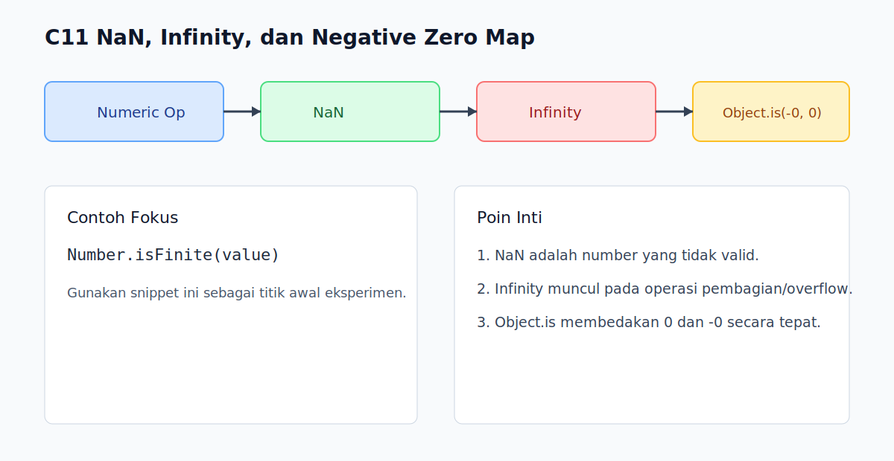

# C11 - NaN, Infinity, dan Negative Zero

## Tujuan

Bab ini bertujuan memahami nilai numerik khusus yang sering muncul saat operasi number edge case.

## Kenapa Bab Ini Penting

Nilai `NaN`, `Infinity`, dan `-0` sering lolos tanpa disadari lalu memicu bug kalkulasi lanjutan.

Dengan mengenali perilakunya, pembaca bisa menulis validasi numerik yang lebih kokoh.

## Konsep Inti

### 1. `NaN` Menandakan Hasil Numerik Tidak Valid

```js
const result = Number('abc');
console.log(result); // NaN
console.log(Number.isNaN(result)); // true
```

`NaN` adalah nilai bertipe `number`, tapi bukan angka valid.

### 2. `Infinity` dan `-Infinity`

```js
console.log(1 / 0);   // Infinity
console.log(-1 / 0);  // -Infinity
```

Nilai ini muncul saat overflow atau pembagian dengan nol tertentu.

### 3. Negative Zero (`-0`) Nyata di JavaScript

```js
const value = -0;
console.log(value === 0);          // true
console.log(Object.is(value, -0)); // true
console.log(Object.is(value, 0));  // false
```

Gunakan `Object.is` jika perlu membedakan `0` dan `-0`.

### 4. Validasi Number yang Lebih Aman

```js
function isFiniteNumber(value) {
  return typeof value === 'number' && Number.isFinite(value);
}
```

`Number.isFinite` membantu menolak `NaN` dan `Infinity`.

## Praktik yang Direkomendasikan

- Validasi input numerik dengan `Number.isFinite`.
- Gunakan `Object.is` hanya pada kasus yang memang butuh bedakan `-0`.
- Catat sumber data yang bisa menghasilkan `NaN` agar mudah ditelusuri.

## Kesalahan Umum

- Mengecek `NaN` dengan `value === NaN`.
- Mengira semua number selalu finite.
- Tidak sadar `-0` bisa memengaruhi format/arah perhitungan tertentu.

## Checkpoint Cepat

1. Kenapa `NaN === NaN` bernilai `false`?
2. Kapan `Infinity` bisa muncul dalam aplikasi?
3. Fungsi apa yang tepat untuk membedakan `0` dan `-0`?

## Ringkasan

- `NaN`, `Infinity`, dan `-0` adalah edge value numerik penting.
- Validasi `Number.isFinite` penting untuk jalur perhitungan kritikal.
- `Object.is` menyediakan perbandingan presisi untuk kasus spesifik.

## Spec Coverage

Bab ini terutama selaras dengan section ECMAScript berikut:

- `6.1.6`
- `6.1.6.1`
- `7.1.4`
- `7.1.5`
- `7.1.6`
- `7.1.7`

Referensi mapping penuh: `../docs/spec-mapping-56.md`.

## Visual Map



## Contoh Runnable

- Lihat contoh: `../examples/C11-nan-infinity-dan-negative-zero/example.js`
- Panduan: `../examples/C11-nan-infinity-dan-negative-zero/README.md`
