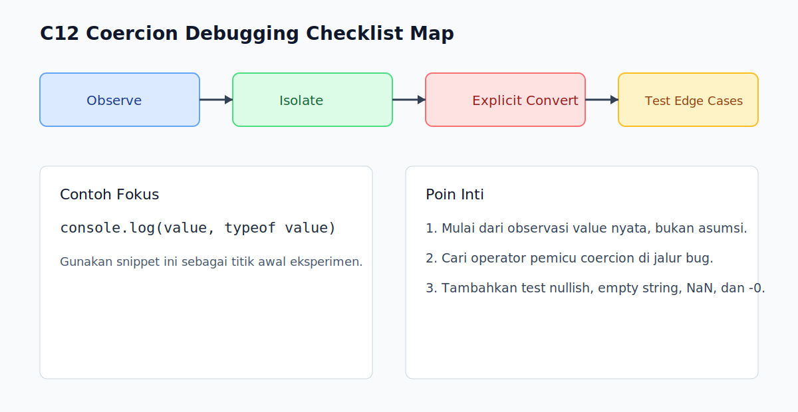

# C12 - Coercion Debugging Checklist

## Tujuan

Bab ini bertujuan menyediakan checklist praktis untuk debugging bug yang melibatkan value, type, dan coercion.

## Kenapa Bab Ini Penting

Saat bug coercion muncul, gejalanya sering terlihat jauh dari akar masalah.

Checklist yang konsisten mempercepat diagnosis dan mencegah trial-and-error berlebihan.

## Konsep Inti

### 1. Mulai dari Observasi Nilai Nyata

Jangan tebak tipe dari tampilan output.

```js
console.log(value, typeof value);
```

Tambahkan observasi `Array.isArray`, `Number.isNaN`, atau `Object.is` sesuai konteks.

### 2. Isolasi Titik Konversi

Cari baris yang memicu coercion:

- operator `+`, `-`, `*`, `/`
- comparison `==`
- kondisi `if`, `&&`, `||`, `!`
- assignment default `||` dan `??`

### 3. Reproduksi dengan Contoh Minimum

Buat snippet kecil yang hanya memuat input dan ekspresi bermasalah.

Ini memudahkan validasi hipotesis tanpa noise dari modul lain.

### 4. Ubah Coercion Implicit Menjadi Eksplisit

```js
const quantity = Number(rawQuantity);
const label = String(rawLabel);
const enabled = Boolean(rawEnabled);
```

Konversi eksplisit membuat intent terbaca saat review.

### 5. Lindungi dengan Test Edge Case

Minimal tambahkan test untuk:

- `null` dan `undefined`
- string kosong
- `0`, `-0`, `NaN`, `Infinity`
- object/array kosong

## Checklist Cepat (Siap Pakai)

1. Cetak `value` + `typeof` di titik masalah.
2. Verifikasi apakah nilai termasuk `null`, `undefined`, array, atau `NaN`.
3. Identifikasi operator yang memicu coercion.
4. Buat reproduksi minimal.
5. Ganti coercion implicit jadi eksplisit.
6. Tambahkan test untuk edge case terkait.

## Kesalahan Umum

- Langsung refactor besar tanpa reproduksi minimal.
- Menambal gejala tanpa mengunci akar masalah dengan test.
- Menganggap semua masalah coercion bisa selesai dengan ganti `==` ke `===` saja.

## Ringkasan

- Debugging coercion butuh observasi tipe yang konkret.
- Reproduksi minimal mempercepat penemuan akar masalah.
- Konversi eksplisit + test edge case adalah penutup yang aman.

## Spec Coverage

Bab ini terutama selaras dengan section ECMAScript berikut:

- `7.1.13`
- `7.1.14`
- `7.1.14.1`
- `7.1.14.2`
- `7.1.15`
- `7.1.16`

Referensi mapping penuh: `../docs/spec-mapping-56.md`.

## Visual Map



## Contoh Runnable

- Lihat contoh: `../examples/C12-coercion-debugging-checklist/example.js`
- Panduan: `../examples/C12-coercion-debugging-checklist/README.md`
