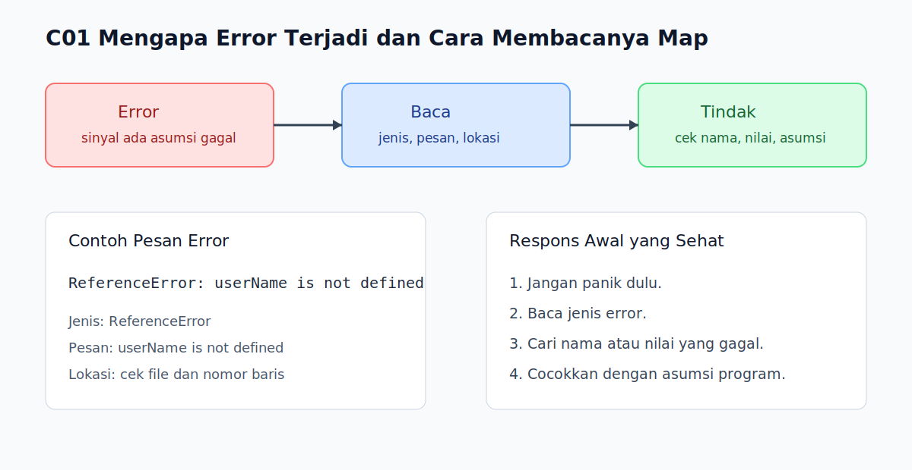

# C01 - Mengapa Error Terjadi dan Cara Membacanya

## Tujuan

Bab ini bertujuan memahami bahwa error adalah sinyal perilaku program dan belajar membaca pesan error secara dasar.

## Kenapa Bab Ini Penting

Pemula sering melihat error sebagai tanda bahwa program "rusak total". Padahal error justru memberi petunjuk penting: bagian mana yang gagal, jenis masalahnya apa, dan kira-kira baris mana yang perlu diperiksa. Sebelum belajar menangani error, pembaca perlu lebih dulu nyaman membaca error.

## Konsep Inti

### 1. Error Adalah Sinyal Bahwa Program Menemui Masalah

```js
console.log(userName);
```

Jika program mencoba memakai sesuatu yang tidak tersedia atau tidak valid, JavaScript akan memberi error. Error bukan musuh tersembunyi, tetapi sinyal bahwa asumsi program tidak terpenuhi.

### 2. Pesan Error Biasanya Memberi Tiga Petunjuk Dasar

```txt
ReferenceError: userName is not defined
```

Biasanya pembaca bisa mengambil tiga informasi awal:

- jenis error, misalnya `ReferenceError`
- pesan inti masalah, misalnya `userName is not defined`
- lokasi kejadian, biasanya file dan nomor baris

### 3. Fokus Pertama Bukan Panik, Tetapi Membaca Polanya

```js
const total = price * quantity;
```

Saat melihat error, pertanyaan awal yang sehat adalah:

- nilai atau nama apa yang bermasalah?
- di baris mana masalah muncul?
- asumsi apa yang ternyata tidak benar?

## Praktik yang Direkomendasikan

- Biasakan membaca jenis error lebih dulu sebelum menebak solusi.
- Periksa nama variabel, nilai input, dan baris yang disebut pada pesan error.
- Anggap error sebagai petunjuk debugging, bukan sekadar kegagalan.

## Kesalahan Umum

- Langsung mengubah banyak baris tanpa memahami pesan error.
- Fokus pada rasa panik, bukan informasi yang sedang diberikan runtime.
- Mengabaikan nomor baris dan hanya membaca satu potong pesan error.

## Checkpoint Cepat

1. Kenapa error bisa dianggap sebagai sinyal, bukan sekadar gangguan?
2. Tiga petunjuk dasar apa yang biasanya bisa dibaca dari error?
3. Mengapa penting membaca jenis error sebelum mencoba memperbaikinya?

## Analogi

- Intuisi Singkat: Error adalah alarm yang memberi tahu bagian mana dari program sedang bermasalah.
- Analogi: Seperti lampu indikator di dashboard kendaraan; lampu itu bukan masalahnya sendiri, tetapi penanda bahwa ada bagian yang perlu diperiksa.
- Batas Analogi: Di JavaScript, pesan error sering lebih spesifik daripada lampu indikator biasa karena bisa menunjukkan jenis masalah dan lokasi kejadiannya.

## Ringkasan

- Error adalah sinyal bahwa program bertemu kondisi yang tidak sesuai harapan.
- Pesan error biasanya memberi jenis masalah, penjelasan singkat, dan lokasi kejadian.
- Membaca error dengan tenang adalah langkah dasar sebelum memperbaiki program.

## Visual Map



## Contoh Runnable

- Lihat contoh: `../examples/C01-mengapa-error-terjadi-dan-cara-membacanya/example.js`
- Lihat contoh tambahan: `../examples/C01-mengapa-error-terjadi-dan-cara-membacanya/example-02.js`
- Lihat contoh tambahan: `../examples/C01-mengapa-error-terjadi-dan-cara-membacanya/example-03.js`
- Panduan: `../examples/C01-mengapa-error-terjadi-dan-cara-membacanya/README.md`
