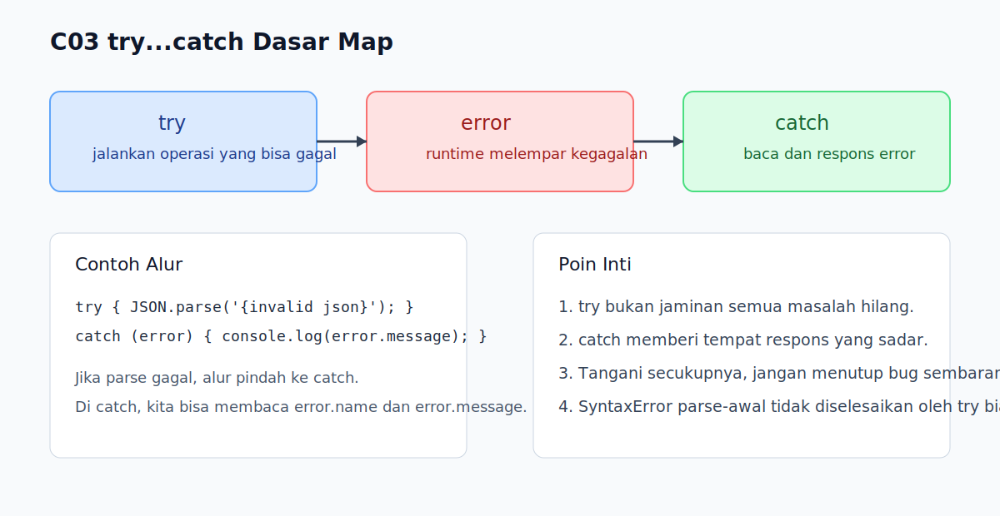

# C03 - `try...catch` Dasar

## Tujuan

Bab ini bertujuan memahami cara menangkap error runtime dengan `try...catch`.

## Kenapa Bab Ini Penting

Setelah pembaca mulai nyaman membaca error, langkah berikutnya adalah memahami bahwa sebagian error runtime bisa ditangani dengan lebih sadar. `try...catch` membantu program tetap mengendalikan alur saat operasi tertentu gagal, terutama ketika kita ingin memberi pesan yang lebih jelas atau mencegah program berhenti mendadak.

## Konsep Inti

### 1. `try` Menandai Bagian Kode yang Berpotensi Gagal

```js
try {
  JSON.parse('{invalid json}');
} catch (error) {
  console.log('Terjadi error');
}
```

Blok `try` dipakai untuk menjalankan operasi yang mungkin melempar error runtime.

### 2. `catch` Menerima Object Error

```js
catch (error) {
  console.log(error.name);
  console.log(error.message);
}
```

Di dalam `catch`, kita bisa membaca informasi error dan menentukan respons yang lebih terkontrol.

### 3. `try...catch` Bukan Alat untuk Menyembunyikan Semua Masalah

```js
try {
  riskyOperation();
} catch (error) {
  console.log('Ada masalah:', error.message);
}
```

Tujuan `try...catch` adalah menangani kegagalan dengan sadar, bukan menutupi bug tanpa analisis.

## Praktik yang Direkomendasikan

- Gunakan `try...catch` pada operasi yang memang berpotensi gagal saat runtime.
- Baca `error.name` dan `error.message` agar respons lebih informatif.
- Tangani error secukupnya dan tetap jaga agar alur program mudah dilacak.

## Kesalahan Umum

- Membungkus terlalu banyak kode sekaligus sehingga sumber error sulit dipersempit.
- Menangkap error lalu mengabaikannya tanpa pesan yang membantu.
- Mengira `try...catch` bisa memperbaiki `SyntaxError` yang membuat file gagal diparse sejak awal.

## Checkpoint Cepat

1. Apa peran blok `try` dan `catch`?
2. Kenapa object `error` penting dibaca, bukan hanya ditangkap?
3. Mengapa `try...catch` tidak boleh dipakai untuk menyembunyikan semua bug?

## Analogi

- Intuisi Singkat: `try...catch` adalah cara menyiapkan rencana cadangan saat operasi tertentu gagal.
- Analogi: Seperti petugas layanan yang mencoba memproses dokumen, lalu jika ada masalah, langsung memindahkan kasus itu ke meja penanganan khusus agar proses tetap terkendali.
- Batas Analogi: Di JavaScript, penanganan error tetap tidak otomatis memperbaiki akar masalah; `catch` hanya memberi kesempatan untuk merespons kegagalan dengan sadar.

## Ringkasan

- `try` menjalankan kode yang berpotensi gagal.
- `catch` menerima error runtime yang dilempar dari blok `try`.
- `try...catch` membantu program menangani kegagalan dengan lebih terkontrol.

## Visual Map



## Contoh Runnable

- Lihat contoh: `../examples/C03-try-catch-dasar/example.js`
- Lihat contoh tambahan: `../examples/C03-try-catch-dasar/example-02.js`
- Lihat contoh tambahan: `../examples/C03-try-catch-dasar/example-03.js`
- Panduan: `../examples/C03-try-catch-dasar/README.md`
