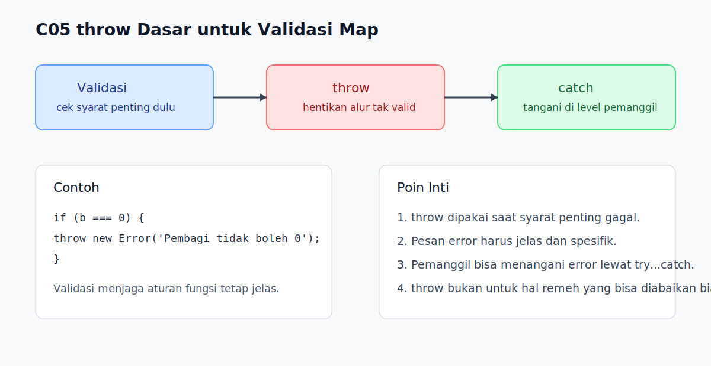

# C05 - `throw` Dasar untuk Validasi

## Tujuan

Bab ini bertujuan memahami cara melempar error secara sadar untuk validasi sederhana.

## Kenapa Bab Ini Penting

Tidak semua error datang dari mesin JavaScript secara otomatis. Kadang kita sendiri perlu menghentikan alur karena input tidak masuk akal atau syarat penting belum terpenuhi. `throw` memberi kita cara untuk menyatakan, "kondisi ini tidak boleh diteruskan."

## Konsep Inti

### 1. `throw` Digunakan untuk Melempar Error Secara Sadar

```js
throw new Error('Input tidak valid');
```

Dengan `throw`, kita bisa menghentikan alur saat mendeteksi kondisi yang memang tidak layak diteruskan.

### 2. `throw` Sering Dipakai Bersama Validasi Sederhana

```js
function divide(a, b) {
  if (b === 0) {
    throw new Error('Pembagi tidak boleh 0');
  }

  return a / b;
}
```

Ini membantu membuat aturan fungsi lebih jelas sejak awal.

### 3. Error yang Dilempar Bisa Ditangani dengan `try...catch`

```js
try {
  divide(10, 0);
} catch (error) {
  console.log(error.message);
}
```

Setelah error dilempar, alurnya bisa ditangani lebih tinggi dengan `catch`.

## Praktik yang Direkomendasikan

- Gunakan `throw` saat ada syarat penting yang gagal dipenuhi.
- Tulis pesan error yang jelas dan langsung menjelaskan masalahnya.
- Gabungkan `throw` dengan validasi sederhana agar fungsi lebih aman dipakai.

## Kesalahan Umum

- Melempar error untuk hal sepele yang sebenarnya masih bisa ditangani biasa.
- Menulis pesan error terlalu samar seperti "ada masalah".
- Tidak membedakan validasi input dengan bug logika lain.

## Checkpoint Cepat

1. Kapan `throw` lebih tepat dipakai daripada `console.log()` biasa?
2. Kenapa pesan error dari `throw` perlu jelas?
3. Bagaimana hubungan `throw` dengan `try...catch`?

## Analogi

- Intuisi Singkat: `throw` adalah cara menyetop proses saat aturan penting dilanggar.
- Analogi: Seperti petugas gerbang yang menolak masuk jika syarat utama belum terpenuhi, lalu memberi alasan penolakannya.
- Batas Analogi: Di JavaScript, `throw` tidak otomatis menyelesaikan masalah; ia hanya memindahkan kegagalan itu ke alur penanganan yang tepat.

## Ringkasan

- `throw` dipakai untuk melempar error secara sadar.
- `throw` berguna untuk validasi sederhana yang harus menghentikan alur.
- Pesan error yang jelas membuat debugging dan penggunaan fungsi lebih mudah.

## Visual Map



## Contoh Runnable

- Lihat contoh: `../examples/C05-throw-dasar-untuk-validasi/example.js`
- Lihat contoh tambahan: `../examples/C05-throw-dasar-untuk-validasi/example-02.js`
- Lihat contoh tambahan: `../examples/C05-throw-dasar-untuk-validasi/example-03.js`
- Panduan: `../examples/C05-throw-dasar-untuk-validasi/README.md`
