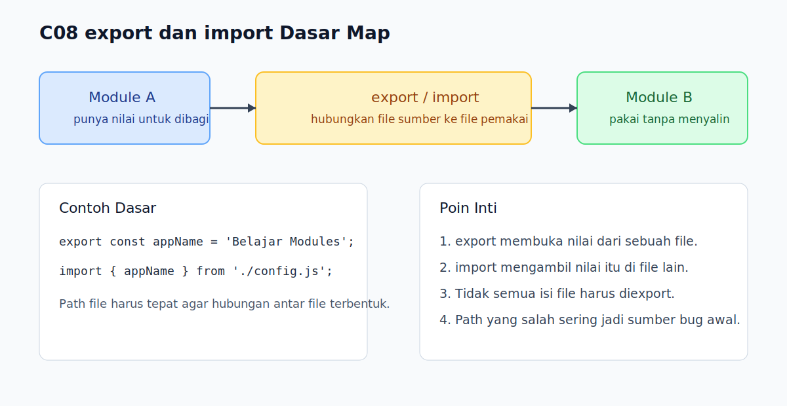

# C08 - `export` dan `import` Dasar

## Tujuan

Bab ini bertujuan memahami alur dasar berbagi kode antar file dengan `export` dan `import`.

## Kenapa Bab Ini Penting

Setelah tahu mengapa module dibutuhkan, pembaca perlu memahami mekanisme dasarnya. `export` dipakai untuk membuka bagian kode agar bisa dipakai file lain, sedangkan `import` dipakai untuk mengambil bagian itu. Ini adalah fondasi modularisasi di JavaScript modern.

## Konsep Inti

### 1. `export` Membuka Nilai dari Sebuah Module

```js
export const appName = 'Belajar Modules';
```

Nilai yang diexport bisa berupa variable, function, atau hal lain yang memang ingin dipakai file lain.

### 2. `import` Mengambil Nilai dari Module Lain

```js
import { appName } from './config.js';
```

File yang mengimpor bisa memakai nilai itu tanpa menyalin isinya.

### 3. Jalur File Harus Tepat

```js
import { appName } from './config.js';
```

Path seperti `./config.js` penting karena JavaScript perlu tahu file sumber yang tepat.

## Praktik yang Direkomendasikan

- Export hanya nilai yang memang perlu dipakai dari luar file.
- Gunakan path module yang jelas dan konsisten.
- Pisahkan file berdasarkan tanggung jawab agar `import` mudah dibaca.

## Kesalahan Umum

- Salah menulis path file saat `import`.
- Mengira semua isi file otomatis tersedia di module lain.
- Menaruh terlalu banyak hal berbeda dalam satu file export.

## Checkpoint Cepat

1. Apa beda peran `export` dan `import`?
2. Kenapa path file penting saat `import`?
3. Mengapa tidak semua isi file perlu diexport?

## Analogi

- Intuisi Singkat: `export` adalah cara sebuah file menawarkan isi tertentu, dan `import` adalah cara file lain memakainya.
- Analogi: Seperti satu buku menyediakan halaman rujukan tertentu, lalu buku lain menyebut dengan jelas halaman mana yang sedang dirujuk.
- Batas Analogi: Di JavaScript, hubungan itu bersifat operasional, bukan hanya referensi bacaan, karena file lain benar-benar memakai nilai yang diexport.

## Ringkasan

- `export` membuka nilai dari sebuah module.
- `import` mengambil nilai dari module lain.
- Path file yang benar adalah bagian penting dari alur modularisasi.

## Visual Map



## Contoh Runnable

- Lihat contoh: `../examples/C08-export-dan-import-dasar/example.js`
- Lihat contoh tambahan: `../examples/C08-export-dan-import-dasar/example-02.js`
- Lihat contoh tambahan: `../examples/C08-export-dan-import-dasar/example-03.js`
- Panduan: `../examples/C08-export-dan-import-dasar/README.md`
