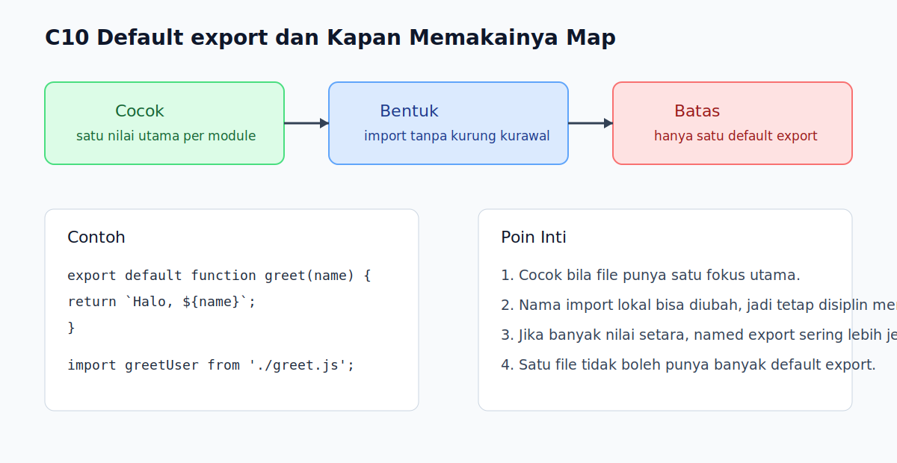

# C10 - Default `export` dan Kapan Memakainya

## Tujuan

Bab ini bertujuan memahami default export, batasnya, dan kapan lebih tepat dipakai.

## Kenapa Bab Ini Penting

Selain named export, JavaScript juga punya default export. Pola ini berguna saat satu module terutama menawarkan satu nilai utama. Namun, kalau dipakai tanpa pertimbangan, default export juga bisa membuat hubungan antar file terasa kurang eksplisit dibanding named export.

## Konsep Inti

### 1. Default `export` Dipakai untuk Satu Nilai Utama

```js
export default function greet(name) {
  return `Halo, ${name}`;
}
```

Default export biasanya dipakai saat file memang berpusat pada satu function, class, atau nilai utama.

### 2. Default `import` Tidak Memakai Kurung Kurawal

```js
import greet from './greet.js';
```

Karena yang diambil adalah default export, bentuk import-nya berbeda dari named import.

### 3. Default Export Tidak Selalu Pilihan Terbaik

```js
import greetUser from './greet.js';
```

Karena nama local import bisa diubah bebas, pembaca kadang perlu usaha tambahan untuk tahu nilai aslinya. Itulah sebabnya default export paling cocok saat nilai utamanya memang sangat jelas.

### 4. Satu Module Hanya Punya Satu Default Export

```js
export default function greet(name) {
  return `Halo, ${name}`;
}
```

Sebuah module tidak bisa memiliki banyak default export sekaligus. Jika sebuah file perlu membagikan banyak nilai setara, named export biasanya lebih cocok.

## Praktik yang Direkomendasikan

- Gunakan default export saat module benar-benar punya satu fokus utama.
- Gunakan named export bila module membagikan beberapa nilai setara.
- Jaga nama import tetap masuk akal walau bisa diubah bebas.

## Kesalahan Umum

- Memakai default export untuk module yang sebenarnya berisi banyak utilitas setara.
- Mencoba membuat lebih dari satu default export dalam satu module.
- Mengira default import harus memakai nama asli file.
- Membuat nama import lokal yang terlalu berbeda sampai membingungkan pembaca.

## Checkpoint Cepat

1. Kapan default export terasa cocok?
2. Apa beda bentuk import default dan named?
3. Kenapa default export kadang kurang eksplisit?

## Analogi

- Intuisi Singkat: Default export seperti satu barang utama yang ditonjolkan dari sebuah kotak.
- Analogi: Seperti satu buku yang terutama dikenal lewat satu judul utama, sementara isi lainnya bukan fokus utamanya.
- Batas Analogi: Di JavaScript, nama yang dipakai saat import default bisa berubah, jadi pembaca tetap perlu disiplin menjaga penamaan agar jelas.

## Ringkasan

- Default export cocok untuk satu nilai utama dalam sebuah module.
- Default import tidak memakai kurung kurawal.
- Satu module hanya bisa punya satu default export.
- Named export sering lebih eksplisit jika module punya beberapa nilai penting.

## Visual Map



## Contoh Runnable

- Lihat contoh: `../examples/C10-default-export-dan-kapan-memakainya/example.js`
- Lihat contoh tambahan: `../examples/C10-default-export-dan-kapan-memakainya/example-02.js`
- Lihat contoh tambahan: `../examples/C10-default-export-dan-kapan-memakainya/example-03.js`
- Panduan: `../examples/C10-default-export-dan-kapan-memakainya/README.md`
