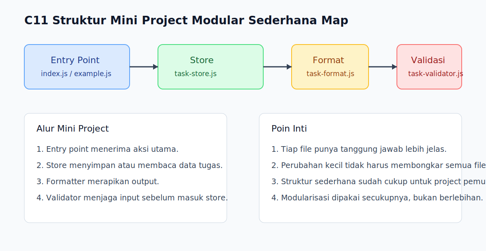

# C11 - Struktur Mini Project Modular Sederhana

## Tujuan

Bab ini bertujuan menyusun contoh mini project kecil dengan pemisahan file yang masuk akal untuk pemula.

## Kenapa Bab Ini Penting

Setelah belajar `export`, `import`, named export, dan default export, pembaca perlu melihat bagaimana semuanya dipakai bersama dalam bentuk project kecil. Di tahap ini, fokusnya bukan membuat arsitektur rumit, tetapi membangun kebiasaan memisahkan tanggung jawab file secara masuk akal.

## Konsep Inti

### 1. Pisahkan Entry Point, Logic, dan Data Sederhana

```js
// index.js
import { addTask } from './task-store.js';
```

Project modular sederhana biasanya punya file masuk utama, file logic, dan kadang file utilitas atau data.

### 2. Setiap File Sebaiknya Punya Tanggung Jawab Jelas

```js
// task-store.js
export function addTask(task) {}
```

Kalau satu file fokus pada satu jenis tanggung jawab, pembaca lebih mudah tahu harus mencari apa di mana.

### 3. Modularisasi yang Baik Membantu Perubahan Kecil Tetap Terkendali

```js
// task-format.js
export function formatTask(task) {}
```

Saat logic format berubah, kita tidak harus membongkar seluruh file utama.

## Praktik yang Direkomendasikan

- Mulai dari pemisahan sederhana: file utama, file logic, dan file utilitas bila perlu.
- Jaga nama file tetap deskriptif.
- Hindari memecah file terlalu kecil bila belum ada manfaat yang jelas.

## Kesalahan Umum

- Membuat semua file serba campur walau sudah memakai module.
- Memecah terlalu banyak file untuk project yang masih sangat kecil.
- Membuat entry point berisi semua logic inti padahal modul lain sudah ada.

## Checkpoint Cepat

1. Kenapa mini project kecil tetap mendapat manfaat dari modularisasi?
2. Apa tanda bahwa sebuah file sebaiknya dipisah dari file utama?
3. Kenapa pemisahan yang terlalu berlebihan juga bisa jadi masalah?

## Analogi

- Intuisi Singkat: Mini project modular adalah latihan menyusun beberapa buku kecil yang saling melengkapi, bukan satu bundel halaman acak.
- Analogi: Seperti meja kerja yang punya laci berbeda untuk alat, dokumen, dan catatan; semua masih dekat, tetapi tidak tercampur sembarangan.
- Batas Analogi: Di JavaScript, pemisahan file harus tetap mengikuti hubungan pemakaian yang nyata, jadi struktur tidak boleh dibuat hanya demi terlihat rapi.

## Ringkasan

- Mini project modular membantu pembaca melihat modularisasi dalam bentuk nyata.
- Entry point, logic, dan utilitas sederhana sebaiknya dipisah secukupnya.
- Tujuan utamanya adalah kejelasan tanggung jawab, bukan kompleksitas struktur.

## Visual Map



## Contoh Runnable

- Lihat contoh: `../examples/C11-struktur-mini-project-modular-sederhana/example.js`
- Lihat contoh tambahan: `../examples/C11-struktur-mini-project-modular-sederhana/example-02.js`
- Lihat contoh tambahan: `../examples/C11-struktur-mini-project-modular-sederhana/example-03.js`
- Panduan: `../examples/C11-struktur-mini-project-modular-sederhana/README.md`
