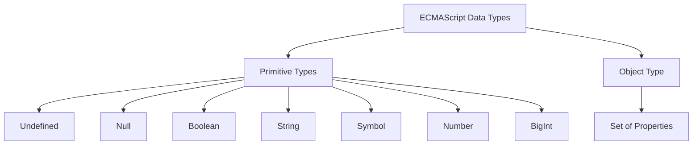

# CH-02: The Concept of Type

*Pemetaan ECMA-262: Clause 14 (Scopes) & Clause 6 (Data Types)*

Tahukah Anda apa itu "Tipe" dalam kacamata spesifikasi? Bukan sekadar label, melainkan sebuah definisi himpunan matematika.

## Mental Model: "Himpunan Perangko"
Bayangkan sebuah koleksi perangko (Values). "Type" adalah kriteria yang menentukan apakah sebuah kepingan data boleh masuk ke album tertentu. 
- Jika datanya `true`, ia masuk ke album **Boolean**.
- Jika datanya `"Hello"`, ia masuk ke album **String**.
- Jika datanya `42`, ia masuk ke album **Number**.

---

## 1. Definisi Formal (Clause 4.4.4)
Dalam ECMAScript, sebuah **Type** adalah **"A set of data values"**. Semua nilai data yang didefinisikan dalam Clause 6 dikategorikan ke dalam tipe-tipe tertentu.

## 2. Struktur Tipe di JavaScript
Spesifikasi membagi dunia data menjadi dua kategori besar utama:

## 3. Dinamika Nilai vs Kontainer
Berbeda dengan bahasa seperti C++ atau Java:
- Di JavaScript, yang memiliki tipe adalah **NILAI (Value)**, bukan variabelnya.
- Variabel hanyalah wadah (Slot) yang bisa berganti-ganti isinya dari tipe apapun secara dinamis.

---

## Arsitek Mindset: Type Integrity
Memahami tipe sebagai "Himpunan Nilai" membantu kita memprediksi perilaku operasi. Saat Anda melakukan `1 + "2"`, spesifikasi menjalankan algoritma **Type Conversion** untuk memaksa nilai dari satu himpunan masuk ke himpunan lain agar operasi bisa diselesaikan.

---

## Referensi Terkait
- [ECMA-262 Clause 6 - Data Types and Values](https://tc39.es/ecma262/#sec-ecmascript-data-types-and-values)
- [CH-03: Primitive Values & Objects](./CH-03_PrimitiveValuesAndObjects/README.md)

---
> [!NOTE]  
> Eksperimen mengenai identifikasi tipe dan perilaku dinamis dapat dilihat di [examples/](./examples/).
