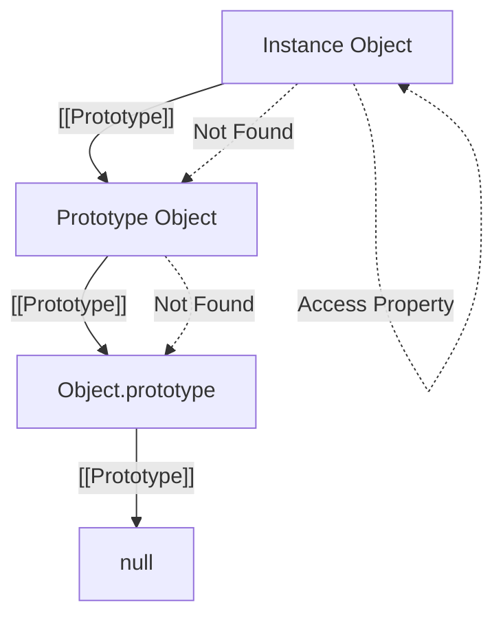

# CH-04: Inheritance Foundations

*Pemetaan ECMA-262: Clause 6.1.7.2 (Object Internal Methods and Slots)*

JavaScript tidak menggunakan kelas tradisional seperti Java untuk pewarisan, melainkan menggunakan delegasi melalui **Prototype Chain**. (Clause 4.4.7 - 4.4.8).

## Mental Model: "Sistem Pinjam-Meminjam"
Bayangkan Anda adalah seorang koki (Object). Anda punya pisau sendiri (Own Properties). Tapi jika Anda butuh oven yang tidak Anda miliki, Anda akan meminjamnya dari dapur utama (Prototype). 

Jika dapur utama tidak punya, dapur tersebut akan meminjam dari gudang pusat (Prototype dari Prototype). Proses mencari ke atas ini disebut **Prototype Chain**.

---

## 1. Prototype (Clause 4.4.7)
Dalam spesifikasi, **Prototype** adalah **"Object that provides shared properties for other objects"**. Saat sebuah objek dibuat, ia seringkali dikaitkan dengan objek lain yang menjadi sumber "warisannya".

## 2. Inheritance (Clause 4.4.8)
**Inheritance** adalah mekanisme di mana sebuah objek memperoleh akses ke properti-properti milik prototipenya. Penting untuk diingat bahwa ini adalah sistem **Delegasi**, bukan penyalinan (copying).

## 3. Slot Internal `[[Prototype]]`
Secara teknis, hubungan ini disimpan dalam slot internal tersembunyi yang disebut `[[Prototype]]`. Dalam kode sehari-hari, Anda mungkin mengaksesnya via `__proto__` atau menggunakan fungsi standar `Object.getPrototypeOf()`.

---

## Arsitek Mindset: Delegation over Copying
Memahami bahwa inheritance di JS adalah delegasi membantu Anda menghindari pemborosan memori. Alih-alih memberikan setiap instance method yang sama, taruhlah method tersebut di prototype sehingga seribu instance bisa berbagi satu method yang sama di memori.

---

## Referensi Terkait
- [ECMA-262 Clause 6.1.7.2 - Object Internal Methods and Slots](https://tc39.es/ecma262/#sec-object-internal-methods-and-slots)
- [CH-16: Own vs Inherited Properties](./CH-16_OwnVsInheritedProperties/README.md)

---
> [!IMPORTANT]  
> **Key Takeaway:** Inheritance di JavaScript adalah tentang pencarian berantai (*look-up chain*), bukan pewarisan struktur statis.
3. Objek baru tersebut secara otomatis "nyambung" ke `MyConstructor.prototype`.
4. Objek baru Anda kini bisa menikmati semua "Harta Warisan" yang ada di prototipe tersebut.

---
> [!IMPORTANT]
{{ ... }}
