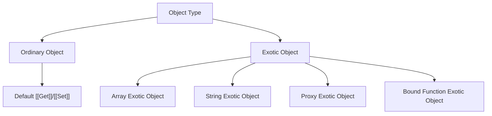

# CH-05: Ordinary vs Exotic Objects

*Pemetaan ECMA-262: Clause 6.1.7 (Object Type)*

Di dunia spesifikasi, tidak semua objek diciptakan setara. Ada objek yang "Patuh Aturan" dan ada objek yang "Punya Keistimewaan". (Clause 4.4.9 - 4.4.10).

## Mental Model: "Warga Sipil vs Diplomat"
- **Ordinary Object**: Ibarat warga sipil biasa. Mereka mengikuti aturan hukum standar (Essential Internal Methods) tanpa pengecualian.
- **Exotic Object**: Ibarat diplomat. Mereka mungkin punya kekebalan hukum atau cara kerja khusus untuk tugas tertentu (seperti Array yang panjangnya otomatis berubah).

---

## 1. Ordinary Object (Clause 4.4.9)
Sebuah objek disebut **Ordinary** jika ia memiliki perilaku *default* untuk seluruh **Essential Internal Methods** (seperti `[[Get]]`, `[[Set]]`, `[[Delete]]`, dll). Hampir semua objek yang Anda buat dengan `{}` adalah ordinary objects.

## 2. Exotic Object (Clause 4.4.10)
Sebuah objek disebut **Exotic** jika ia **TIDAK** memiliki perilaku default untuk satu atau lebih *essential internal methods*. Spesifikasi menciptakan mereka untuk menangani kasus khusus yang tidak bisa ditangani oleh perilaku objek standar.

## 3. Contoh Keajaiban Exotic Objects
Kenapa Array bisa otomatis mengubah `length` saat kita menambah elemen? Itu karena Array adalah **Array Exotic Object**. Ia mengganti metode internal `[[DefineOwnProperty]]` default dengan versinya sendiri untuk memantau properti numerik.

---

## Arsitek Mindset: Understanding Magic
Sebagai arsitek, memahami perbedaan ini membantu Anda membedakan mana perilaku objek yang bisa diprediksi secara standar dan mana yang merupakan "Magic" dari spesifikasi. Ini sangat krusial saat Anda bermain dengan **Proxy**, yang secara teknis adalah cara Anda menciptakan Exotic Object kustom sendiri.

---

## Referensi Terkait
- [ECMA-262 Clause 10 - Ordinary and Exotic Objects Behaviors](https://tc39.es/ecma262/#sec-ordinary-and-exotic-objects-behaviors)
- [SR-05: Ordinary and Exotic Objects](../../SR-05_OrdinaryVsExoticObjects/README.md)

---
> [!NOTE]  
> Eksperimen mengenai perilaku unik Exotic Objects dapat dilihat di [examples/](./examples/).
Tapi saat Anda menggunakan Proxy, Anda sedang bermain di wilayah *Exotic Object* karena Proxy bisa mengubah cara objek merespons operasi dasar.
