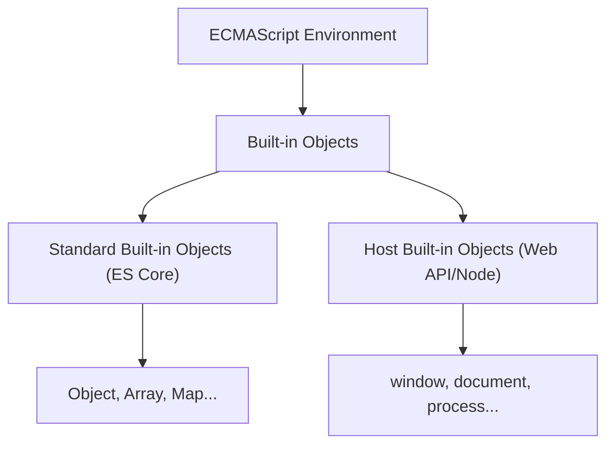

# CH-06: Standard vs Built-in Objects

*Pemetaan ECMA-262: Clause 4.4.11 - 4.4.12*

Seringkali kita mencampuradukkan istilah "Standard" dan "Built-in". Di level arsitek spesifikasi, keduanya memiliki batas yang berbeda namun saling bersinggungan.

## Mental Model: "Menu Restoran vs Sajian di Meja"
- **Standard Object**: Ibarat menu resmi di buku menu restoran (Spec). Semua koki harus tahu cara membuatnya sesuai resep standar.
- **Built-in Object**: Ibarat makanan yang sudah tersaji di meja saat Anda duduk (Runtime). Ia sudah ada di sana bahkan sebelum Anda memesan apapun.

---

## 1. Standard Object (Clause 4.4.11)
Objek disebut **Standard** jika semantiknya **didefinisikan sepenuhnya** oleh spesifikasi ECMA-262. 
> Contoh: `Object`, `Array`, `Function`, `Promise`, `Proxy`, `Intl`.

## 2. Built-in Object (Clause 4.4.12)
Objek disebut **Built-in** jika ia sudah tersedia di lingkungan eksekusi **sejak awal**. 
- Seluruh objek standard adalah built-in objects.
- Namun, **TIDAK SEMUA** built-in objects adalah standard (beberapa mungkin disediakan oleh Host/Platform).

## 3. Garis Potong: Standard Built-in Objects
Sebagian besar waktu, kita berinteraksi dengan **Standard Built-in Objects**. Inilah objek yang definisinya ada di spec DAN sudah ada di global scope saat script dijalankan.

---

## Arsitek Mindset: Platform Agnostic Code
Seorang arsitek harus tahu mana objek yang **Standard** (pasti ada di setiap engine ES yang patuh) dan mana yang **Host Built-in** (hanya ada di browser, atau hanya di Node.js). Mengetahui perbedaan ini adalah kunci menciptakan kode yang *Portabel* dan *Cross-platform*.

---

## Referensi Terkait
- [ECMA-262 Clause 18 - The Global Object](https://tc39.es/ecma262/#sec-global-object)
- [BK-11: Standard Built-in Objects](../../BK-11_StandardBuiltInObjects/README.md)

---
> [!TIP]  
> Eksperimen mengenai identifikasi asal-usul objek dapat dilihat di [examples/](./examples/).

---
> [!NOTE]
> Beberapa objek mungkin *Built-in* tapi bukan *Standard* (misalnya fitur eksperimental yang hanya ada di V8). Sebagai arsitek, selalu usahakan menggunakan *Standard Objects* untuk menjaga portabilitas kode.
