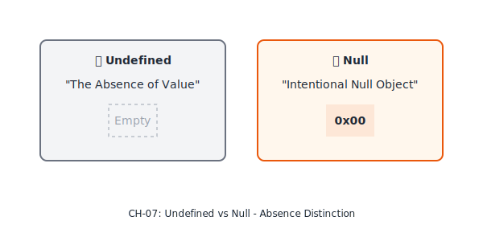
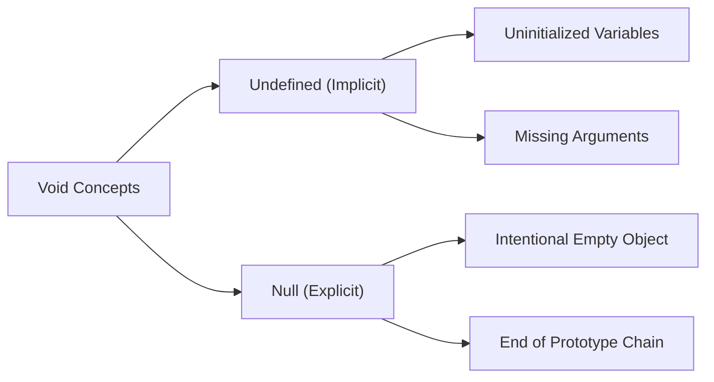

# CH-07: The Undefined & Null Types

*Pemetaan ECMA-262: Clause 6.1.1 (The Undefined Type) & 6.1.2 (The Null Type)*

Seringkali kita bingung membedakan antara "Belum ada" dan "Sengaja ditiadakan". Spesifikasi memberikan batas tegas untuk keduanya. (Clause 4.4.13 - 4.4.16).

## Mental Model: "Parkiran Kosong"
- **Undefined**: Ibarat sebuah lahan parkir yang **belum diberi garis atau nomor**. Anda tidak tahu itu lahan parkir atau bukan sampai pengelola (Engine) menetapkannya.
- **Null**: Ibarat lahan parkir yang **sudah ada nomornya but isinya kosong**. Anda sengaja membiarkannya kosong untuk menandakan "Tidak ada mobil di sini".

---

## 1. Undefined Type (Clause 4.4.13 - 4.4.14)
**Undefined** adalah tipe yang hanya memiliki satu anggota nilai: `undefined`.

- **Kegunaan**: Digunakan secara otomatis oleh engine saat sebuah variabel dideklarasikan tapi belum diberi nilai, atau saat sebuah fungsi tidak mengembalikan nilai apapun.

## 2. Null Type (Clause 4.4.15 - 4.4.16)
**Null** adalah tipe yang juga hanya memiliki satu anggota nilai: `null`.
- **Kegunaan**: Digunakan secara **sengaja** oleh programmer untuk merepresentasikan "Absence of any object value". Ini adalah sinyal eksplisit bahwa variabel tersebut memang kosong.

## 3. Keanehan `typeof null`
Satu hal yang sering menjebak adalah `typeof null` menghasilkan `"object"`. Secara spesifikasi, ini sebenarnya adalah **Legacy Bug** dari versi pertama JavaScript yang tetap dipertahankan demi kompatibilitas web. Secara semantik, `null` tetaplah tipe primitif yang berdiri sendiri.

---

## Arsitek Mindset: Semantic Clarity
Gunakan `undefined` untuk membiarkan sistem bekerja secara natural (misalnya mengecek apakah argumen dikirim atau tidak). Gunakan `null` saat Anda ingin secara eksplisit menyatakan bahwa sebuah properti atau variabel **seharusnya berisi objek** namun saat ini sedang kosong.

---

## Referensi Terkait
- [ECMA-262 Clause 6.1.1 - The Undefined Type](https://tc39.es/ecma262/#sec-undefined-type)
- [ECMA-262 Clause 6.1.2 - The Null Type](https://tc39.es/ecma262/#sec-null-type)

---
> [!NOTE]  
> Perbandingan perilaku `undefined` dan `null` dalam operasi logika dapat dilihat di [examples/](./examples/).
