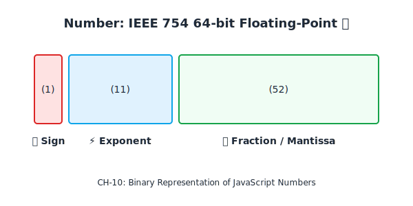
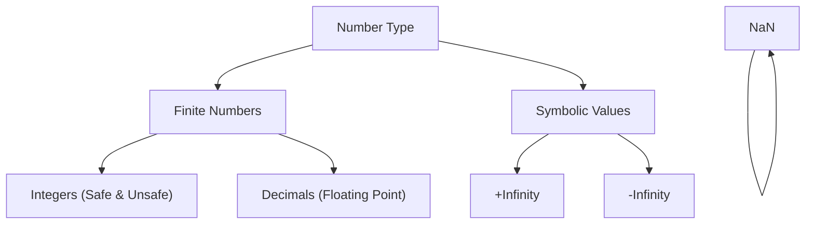

# CH-10: The Number Type, Infinity & NaN

*Pemetaan ECMA-262: Clause 6.1.6.1 & 4.4.23 - 4.4.26*

JavaScript hanya memiliki satu tipe data untuk semua jenis angka: **Double-Precision 64-bit Binary Format (IEEE 754)**. Memahami bagaimana angka disimpan dalam bit adalah kunci untuk menghindari bug presisi yang mematikan. (Clause 4.4.23 - 4.4.28).

## Mental Model: "Garis Bilangan yang Presisi tapi Terbatas"

Bayangkan angka di JavaScript sebagai penggaris yang sangat panjang, namun garis-garis kecilnya hanya bisa sedetail 52-bit (mantissa). Jika Anda mencoba mengukur sesuatu yang lebih kecil dari itu, penggarisnya akan melakukan "pembulatan" ke garis terdekat. Itulah sebabnya `0.1 + 0.2` tidak tepat `0.3`.

---

## 1. Definisi Formal (Clause 4.4.23 - 4.4.24)
**Number Value** adalah nilai numerik 64-bit yang mengikuti standar IEEE 754. 
- **Integer Safe Range**: `-2^53 + 1` sampai `2^53 - 1`. Di luar rentang ini, integer tidak lagi "aman" dan bisa kehilangan presisi.

## 2. Nilai-Nilai Spesial
Selain angka normal, tipe Number mencakup nilai-nilai simbolik:
- **NaN (Not-a-Number)**: Mewakili hasil operasi matematika yang tidak terdefinisi (seperti `0 / 0`). (Clause 4.4.28).
- **Positive & Negative Infinity**: Mewakili nilai yang melampaui batas representasi mesin. (Clause 4.4.25 - 4.4.26).

---

## Arsitek Mindset: Floating-Point Awareness
Sebagai arsitek, jangan pernah membandingkan angka desimal secara langsung dengan `==` atau `===`. Selalu gunakan toleransi kecil (epsilon), atau gunakan **BigInt** jika Anda membutuhkan presisi integer yang tak terbatas. Pahami bahwa `NaN` adalah satu-satunya nilai di JavaScript yang tidak sama dengan dirinya sendiri (`NaN !== NaN`).

---

## Referensi Terkait
- [ECMA-262 Clause 6.1.6.1 - The Number Type](https://tc39.es/ecma262/#sec-ecmascript-language-types-number-type)
- [CH-11: The BigInt Type & Objects](./CH-11_TheBigIntTypeAndObjects/README.md)

---
> [!IMPORTANT]
> **Key Takeaway:** Setiap angka di JavaScript adalah "Floating Point" secara internal. Jangan tertipu oleh tampilannya yang terlihat seperti integer bulat.
