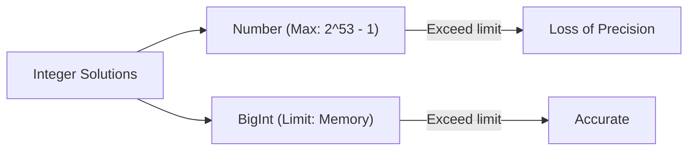

# CH-11: The BigInt Type & Objects

*Pemetaan ECMA-262: Clause 6.1.6.2 (The BigInt Type)*

Saat `Number` mulai kehilangan presisinya di angka raksasa, `BigInt` hadir sebagai penyelamat untuk integritas data integer. (Clause 4.4.29 - 4.4.31).

## Mental Model: "Kertas Tak Terhingga"
Jika `Number` ibarat timbangan digital yang punya batas maksimal (64-bit), maka **BigInt** ibarat sebuah **Kertas Tak Terhingga**. Anda bisa menulis angka sepanjang apapun di atasnya, selama memori komputer Anda masih cukup untuk menampungnya.

---

## 1. BigInt Type & Value (Clause 4.4.29 - 4.4.30)
**BigInt** adalah tipe data primitif yang merepresentasikan nilai integer dengan **Arbitrary Precision** (presisi yang tidak dibatasi oleh jumlah bit tertentu).
- Berbeda dengan `Number`, `BigInt` tidak memiliki nilai NaN atau Infinity.
- Ia hanya bisa menampung angka bulat (integer), tidak bisa desimal.

## 2. BigInt Object (Clause 4.4.31)
**BigInt Object** adalah member dari *Object Type* yang membungkus nilai primitif BigInt.
- **Catatan Spesifikasi**: `BigInt` adalah constructor, tetapi ia **TIDAK BISA** dipanggil dengan operator `new`. Anda memanggilnya sebagai fungsi `BigInt(val)`.

## 3. Aturan Main yang Berbeda
- **Tidak Bisa Campur**: Anda tidak bisa menjumlahkan `BigInt` dengan `Number` secara langsung (misal: `10n + 5`). Anda harus melakukan konversi eksplisit.
- **Division**: Pembagian `BigInt` selalu membuang angka di belakang koma (Integer Division).

---

## Arsitek Mindset: Financial & Security Integrity
Sebagai arsitek, gunakan `BigInt` untuk menangani ID yang sangat besar (seperti Twitter Snowflake IDs), hashing, atau perhitungan kriptografi di mana kehilangan satu digit saja berarti kegagalan sistem. Namun, ingatlah bahwa `BigInt` lebih lambat dibandingkan `Number` dalam hal performa komputasi.

---

## Referensi Terkait
- [ECMA-262 Clause 6.1.6.2 - The BigInt Type](https://tc39.es/ecma262/#sec-ecmascript-language-types-bigint-type)
- [CH-10: The Number Type, Infinity & NaN](./CH-10_TheNumberTypeInfinityAndNaN/README.md)

---
> [!IMPORTANT]  
> `BigInt` bukan pengganti `Number`. Gunakan hanya saat Anda benar-benar membutuhkan presisi di atas `2^53 - 1`.
