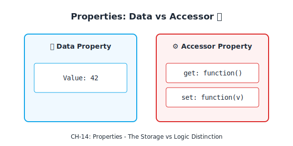
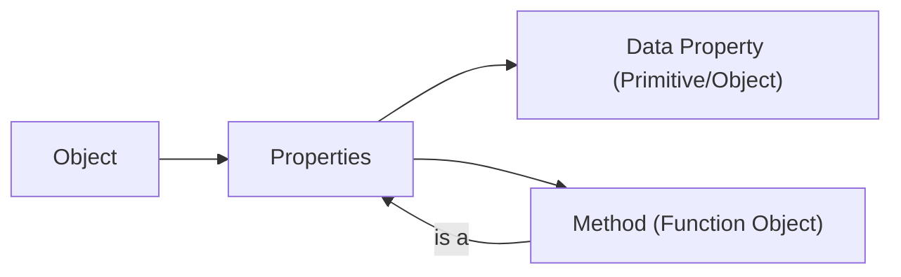

# CH-14: Properties & Methods

*Pemetaan ECMA-262: Clause 6.1.7.1 & 4.4.39*

Bagaimana objek menyimpan data dan perilaku? Rahasianya terletak pada struktur **Property**. Di level spesifikasi, tidak ada perbedaan kasta antara data dan fungsi di dalam objek. (Clause 4.4.36 - 4.4.38).

## Mental Model: "Laci Label"
Bayangkan sebuah objek sebagai lemari laci. Setiap laci memiliki **Label (Key)**.
- Jika isi lacinya adalah selembar kertas bertuliskan angka (Data), kita menyebutnya **Property**.
- Jika isi lacinya adalah sebuah remote kontrol (Function) yang bisa ditekan untuk menjalankan aksi, kita menyebutnya **Method**.

---

## 1. Property (Clause 4.4.36)
**Property** adalah asosiasi antara sebuah **Key** (String atau Symbol) dan sebuah **Value**. Properti adalah unit dasar informasi yang membentuk sebuah objek.

## 2. Method (Clause 4.4.37)
Secara formal, **Method** adalah properti yang nilainya bertipe *Function*.
- Di JavaScript, fungsi adalah "First-class Citizens", sehingga mereka bisa disimpan sebagai nilai properti layaknya angka atau string.

## 3. Built-in Method (Clause 4.4.38)
Metode yang merupakan *built-in function*.
- Contoh: `Array.prototype.indexOf` atau `Object.prototype.toString`. Metode ini sudah tertanam di dalam prototipe objek standar sejak awal.

---

## Arsitek Mindset: Semantic Distinctions
Sebagai arsitek, pahami bahwa metode hanyalah properti biasa. Ini memungkinkan Anda untuk melakukan "Method Swapping" atau "Monkey Patching" (mengganti perilaku metode di runtime), meskipun hal ini harus dilakukan dengan sangat hati-hati untuk menjaga integritas sistem.

---

## Referensi Terkait
- [ECMA-262 Clause 6.1.7.1 - Property Attributes](https://tc39.es/ecma262/#sec-property-attributes)
- [CH-15: Property Attributes](./CH-15_PropertyAttributes/README.md)

---
> [!TIP]  
> Eksperimen mengenai perbedaan semantik properti dan metode dapat dilihat di [examples/](./examples/).
