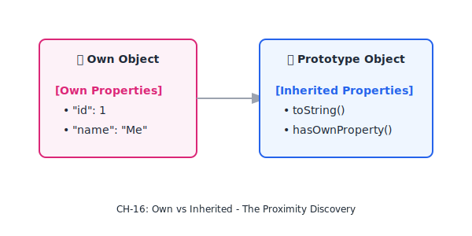
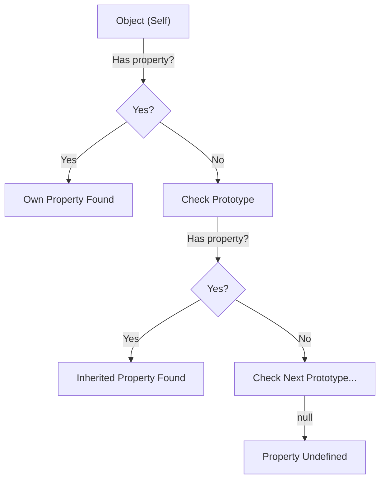

# CH-16: Own vs Inherited Properties

*Pemetaan ECMA-262: Clause 6.1.7 & 4.4.41 - 4.4.42*

Silsilah keluarga properti berakhir di sini. Bagaimana mesin membedakan antara harta milik sendiri dan harta warisan dari leluhur? (Clause 4.4.40 - 4.4.41).

## Mental Model: "Barang di Kantong vs Barang di Rumah"
- **Own Property**: Ibarat barang yang ada di **Kantong Baju Anda** (Object). Anda bisa langsung mengambilnya tanpa bertanya pada siapa pun.
- **Inherited Property**: Ibarat barang yang ada di **Rumah Orang Tua Anda** (Prototype). Jika di kantong Anda tidak ada, Anda akan pergi ke rumah orang tua untuk mencarinya.

---

## 1. Own Property (Clause 4.4.40)
Sebuah properti disebut **Own Property** jika ia terkandung secara langsung di dalam objek tersebut, bukan di dalam prototipenya.

## 2. Inherited Property (Clause 4.4.41)
Sebuah properti disebut **Inherited Property** jika ia tidak ada pada objek tersebut, namun ditemukan pada satu atau lebih objek dalam **Prototype Chain** dari objek tersebut.

---

## Arsitek Mindset: Shadowing & Performance
Pahami konsep **Shadowing**: Jika Anda membuat *Own Property* dengan nama yang sama dengan *Inherited Property*, maka Anda "menutupi" akses ke properti warisan tersebut. Sebagai arsitek, berhati-hatilah dengan `for...in` karena ia akan melewati seluruh *Inherited Properties* yang *enumerable*, yang bisa menyebabkan bug logika jika Anda hanya mengharapkan harta milik sendiri.

---

## Referensi Terkait
- [ECMA-262 Clause 14.3.9 - Property Definition](https://tc39.es/ecma262/#sec-property-definitions)
- [CH-04: Inheritance Foundations](./CH-04_InheritanceFoundations/README.md)

---
> [!TIP]  
> Gunakan `Object.hasOwn(obj, prop)` untuk pengecekan harta milik sendiri yang paling aman dan modern.
