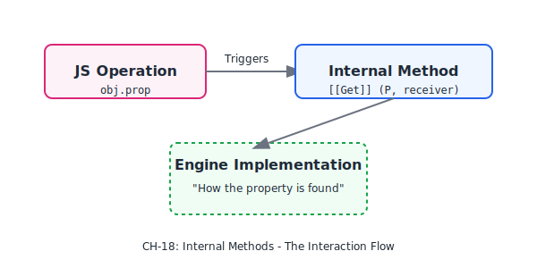
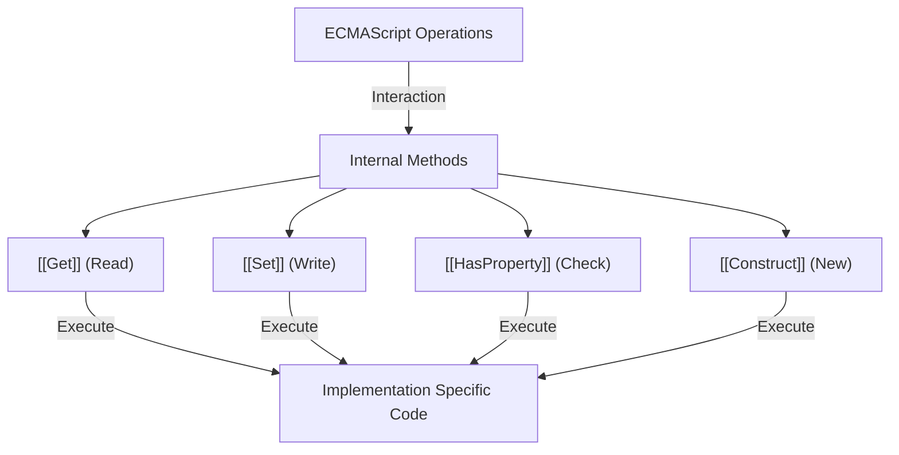

# CH-18: Internal Methods

*Pemetaan ECMA-262: Clause 6.1.7.2 & 4.4.44*

Jika Slot adalah "Data Rahasia", maka **Internal Methods** adalah "Insting Dasar". Setiap objek di JavaScript tahu cara melakukan hal-hal dasar (seperti mengambil properti) karena metode ini. (Clause 4.4.44).

## Mental Model: "Insting Bertahan Hidup"
Bayangkan setiap objek adalah makhluk hidup.

- **Property**: Adalah pakaian yang dipakai (Bisa diganti).
- **Internal Method**: Adalah insting seperti "Bernapas" atau "Makan". 
- Objek tidak perlu diajari cara melakukan `[[Get]]` atau `[[Set]]`; itu sudah tertanam di "DNA" mereka sebagai objek ECMAScript.

---

## 1. Definisi Formal (Clause 4.4.44)
**Internal Method** adalah algoritma internal yang mendefinisikan perilaku dasar sebuah objek saat berinteraksi dengan runtime.
- **Essential Behaviors**: Ada set metode internal yang **wajib** dimiliki oleh semua objek (Essential Internal Methods).
- **Contoh**: `[[Get]]`, `[[Set]]`, `[[Delete]]`, `[[GetPrototypeOf]]`.

## 2. Objek Biasa vs Objek Eksotis
- **Ordinary Objects**: Menggunakan implementasi default untuk semua metode internal.
- **Exotic Objects**: Memiliki satu atau lebih metode internal yang perilakunya didefinisikan secara khusus (berbeda dari default). Contoh: `Array` adalah eksotis karena metode `[[DefineOwnProperty]]`-nya disesuaikan untuk menangani properti `length`.

---

## Arsitek Mindset: The Proxy Power
Memahami metode internal adalah kunci untuk menguasai **Proxy API**. Sebuah `Proxy` sebenarnya adalah "Interseptor Insting". Saat Anda membuat proxy, Anda sebenarnya sedang mengganti atau menambahkan logika di depan metode internal seperti `[[Get]]` atau `[[Set]]`. Inilah kekuatan arsitektur JavaScript yang paling fleksibel.

---

## Referensi Terkait
- [ECMA-262 Clause 10.1 - Essential Internal Methods](https://tc39.es/ecma262/#sec-essential-internal-methods)
- [BK-01/CH-05: Ordinary vs Exotic Objects](../CH-05_OrdinaryVsExoticObjects/README.md)

---
> [!IMPORTANT]
> Tanpa metode internal, sebuah objek hanyalah sekumpulan data mati. Metode ini adalah mesin yang membuat objek tersebut "hidup" dan bisa berinteraksi dengan kode Anda.
