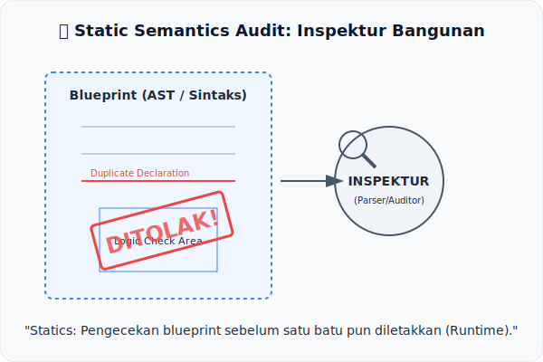

# CH-01: Algorithm Static Semantics

*Pemetaan ECMA-262: Clause 5.2.4 (Static Semantics)*

Mengapa ada aturan yang tidak bisa dijelaskan hanya dengan "Bentuk" (Sintaks)? Di sinilah **Algorithm Static Semantics** berperan sebagai "Inspektur Kelayakan" dalam mesin JavaScript.

## Mental Model: "Inspektur Kelayakan Bangunan"
Bayangkan sebuah blueprint bangunan (**Sintaks**). Blueprint tersebut menunjukkan ada pintu dan jendela (Grammar). Namun, **Algorithm Static Semantics** adalah inspektur yang memeriksa: 
- "Apakah pintu ini terhubung ke ruangan yang benar?"
- "Apakah kabel listriknya aman?"
- "Apakah tangga ini mengarah ke lantai yang memang ada?"

Inspektur ini bekerja **sebelum** siapapun diizinkan menghuni bangunan tersebut (*Runtime*). Jika inspektur menemukan cacat logika di blueprint, ia akan memberikan stempel "Ditolak" (**Syntax Error**) seketika.

---

## 1. Definisi Formal (Clause 5.2.4)
Dalam spesifikasi ECMA-262, *Static Semantics* didefinisikan sebagai algoritma yang terkait dengan produk tata bahasa (*Grammar Production*). Berbeda dengan *Runtime Semantics*, algoritma ini tidak menghasilkan nilai eksekusi, melainkan:
- **Informasi Struktural**: Mengidentifikasi nama-nama variabel yang di-bind.
- **Validasi Logika**: Memastikan tidak ada penggunaan keyword yang salah konteks (seperti `super` di luar kelas).

## 2. Mekanisme Syntax-Directed Operations
Sebagian besar semantik statis direpresentasikan sebagai **Syntax-Directed Operations**. Ini adalah fungsi yang "menempel" pada node di AST (Abstract Syntax Tree) dan bekerja secara rekursif. Contoh operasinya:
- **`BoundNames`**: Digunakan untuk mengumpulkan semua nama variabel yang dideklarasikan oleh sebuah statement.
- **`Contains`**: Digunakan untuk mengecek apakah sebuah node mengandung simbol tertentu (misal: apakah fungsi ini mengandung `await`?).

---

## Arsitek Mindset: Integritas vs Kecepatan
*Runtime Semantics* berfokus pada **Kecepatan** eksekusi, sedangkan *Static Semantics* berfokus pada **Integritas** kode. Sebagai arsitek, memahami ini membantu Anda menulis kode yang lebih dapat diprediksi. Anda tidak perlu menebak-nebak kapan sebuah error muncul, karena aturan statis memastikan "kebersihan" kode sejak tahap parsing.

---

## Referensi Terkait
- [ECMA-262 Clause 5.2.4 - Static Semantics](https://tc39.es/ecma262/#sec-static-semantics)

---
> [!TIP]  
> Pelajari bagaimana inspektur ini bekerja mengaudit kode secara otomatis dalam simulasi di [examples/static_audit_sim.js](./examples/static_audit_sim.js).
