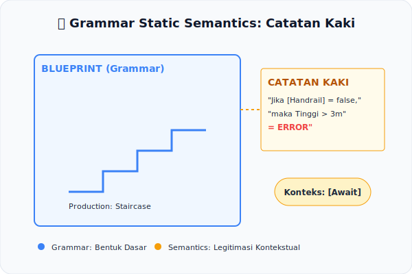

# CH-02: Grammar Static Semantics

*Pemetaan ECMA-262: Clause 5.1 (Grammar) & 5.2.4 (Linkage)*

Jika CH-01 membahas tentang "Inspektur", maka CH-02 membahas tentang "Buku Peraturan" yang dibawa inspektur tersebut saat melihat Blueprint Tata Bahasa (AST).

## Mental Model: "Catatan Kaki pada Blueprint"
Bayangkan sebuah Blueprint arsitektur. Di dekat gambar tangga, ada catatan kaki kecil: 
> *"Tangga tidak boleh lebih tinggi dari 3 meter jika tanpa pegangan tangan"*

- **Blueprint:** Adalah Grammar (Bentuk tangga).
- **Catatan Kaki:** Adalah **Static Semantics** (Aturan legitimasi/keselamatannya).

Grammar memberi tahu Anda *apa* yang bisa dibangun, sementara Static Semantics memberi tahu Anda *kondisi* apa yang harus dipenuhi agar bangunan tersebut dianggap legal.

---

## 1. Menghubungkan Produksi ke Aturan
Grammar sangat ahli dalam mendefinisikan *bagaimana* kode ditulis (struktur). Namun, ia memerlukan **Static Semantics** untuk mendefinisikan *legitimasi* dalam konteks tertentu. Aturan semantik statis "menempel" langsung pada *Grammar Productions*.

### Contoh: Parameterized Productions
Salah satu fitur tercanggih dalam spesifikasi ECMA-262 adalah penggunaan **Grammatical Parameters** (seperti `[Yield]`, `[Await]`, `[Return]`).
- Aturan statis mengecek apakah parameter ini aktif atau tidak dalam sebuah produksi grammar.
- Contoh: Produksi `Expression[Yield, Await]` akan berubah perilakunya secara statis tergantung apakah kita berada di dalam fungsi generator (`Yield`) atau fungsi async (`Await`).

## 2. Rantai Delegasi Semantik
Aturan semantik statis seringkali bersifat delegatif (rekursif). 
Misalnya, aturan `VarDeclaredNames` pada sebuah `Block`:
- Ia tidak mencari nama sendiri secara acak.
- Ia memanggil aturan `VarDeclaredNames` pada setiap `StatementList` di dalamnya, yang kemudian mengalir ke level token terkecil. Ini memastikan seluruh pohon diperiksa sesuai aturan "Buku Peraturan".

---

## Arsitek Mindset: Struktur vs Legitimasi
Memahami link antara grammar dan semantik membantu Anda melakukan *debugging* pada level bahasa. Anda akan mengerti bahwa `SyntaxError` seringkali bukan karena salah ketik, melainkan karena Anda melanggar aturan semantik yang menempel pada struktur yang sebenarnya "terlihat" benar secara grammar.

---

## Referensi Terkait
- [ECMA-262 Clause 5.1 - Syntactic and Lexical Grammars](https://tc39.es/ecma262/#sec-syntactic-and-lexical-grammars)

---
> [!TIP]  
> Lihat bagaimana parameter grammar mengubah validitas kode secara statis dalam simulasi di [examples/grammar_audit_sim.js](./examples/grammar_audit_sim.js).
