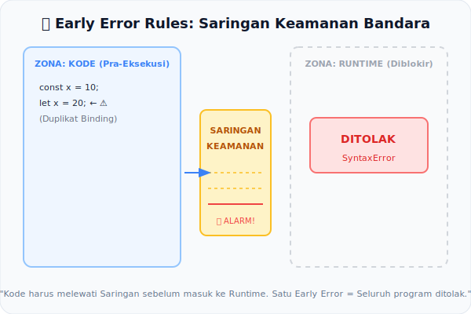

# CH-03: Early Error Rules

*Pemetaan ECMA-262: Static Semantics: Early Errors*

Mengapa beberapa kesalahan di JavaScript membuat aplikasi tidak jalan sama sekali, bahkan sebelum baris pertama dieksekusi? Inilah yang disebut **Early Error**.

## Mental Model: "Saringan Keamanan Bandara"
Bayangkan Anda sedang di bandara. Ada dua jenis pemeriksaan:
1. **Pemeriksaan Tiket (Early Error):** Petugas mencegat Anda di gerbang karena tiket Anda palsu. Anda tidak pernah sampai ke pesawat.
2. **Pemeriksaan di Pesawat (Runtime Error):** Anda sudah terbang, tapi tiba-tiba pilot sadar bensinnya habis.

**Early Error** adalah petugas keamanan (Auditor Statis) yang memastikan barang-barang terlarang tidak masuk ke ruang eksekusi. Jika saringan ini berbunyi, seluruh perjalanan (program) dibatalkan seketika.

---

## 1. Definisi Formal (Fase Parsing)
*Early Errors* didefinisikan secara khusus dalam spesifikasi di bawah setiap produksi grammar yang relevan. Jika sebuah script atau modul mengandung *Early Error*, maka script tersebut tidak akan pernah masuk ke fase **Execution** (Runtime).

### Perbedaan Kritis:
- **Lexical/Grammar Error**: Struktur teks salah (misal: `functon` - salah ketik keyword).
- **Early Error (Static Semantics)**: Teks benar secara grammar, tapi dilarang secara peraturan (misal: `const a;` - secara grammar benar sebagai deklarasi, tapi secara semantik statis dilarang tanpa inisialisasi).

## 2. Pengecekan Utama dalam "Saringan"
Beberapa hal yang memicu alarm Early Error:
- **Binding Duplicates**: Mendeklarasikan `let` atau `const` dengan nama yang sudah ada di scope yang sama.
- **Strict Mode Restrictions**: Penggunaan `with` statement atau keyword yang dilindungi.
- **Async/Await Context**: Menggunakan `await` di luar fungsi async (kecuali top-level module).
- **Invalid Super**: Menggunakan `super()` di luar constructor kelas.

## 3. Implikasi bagi Mesin (Stop the World)
Satu saja *Early Error* dalam sebuah file/module akan menggagalkan pemuatan seluruh file tersebut. Ini menjamin integritas; mesin tidak akan mencoba menjalankan kode yang "cacat dari lahir".

---

## Arsitek Mindset: Catch Early, Run Fast
Memahami Early Errors membantu Anda mengerti alasan *mengapa* mesin JavaScript menolak struktur tertentu secara instan. Ini adalah barisan pertahanan pertama yang memastikan kode yang mulai dieksekusi adalah kode yang sudah "Lulus Sertifikasi" secara struktural.

---

## Referensi Terkait
- [ECMA-262: Early Error Definitions](https://tc39.es/ecma262/#sec-early-error-rules)

---
> [!TIP]  
> Rasakan bagaimana instruksi mesin berhenti total saat mendeteksi Early Error dalam simulasi di [examples/early_error_sim.js](./examples/early_error_sim.js).
