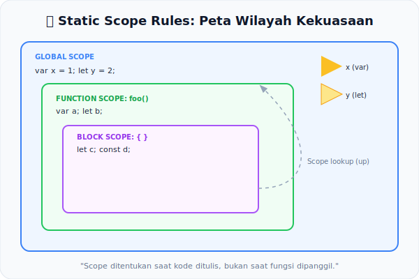

# CH-04: Static Scope Rules

*Pemetaan ECMA-262: Clause 14 (Scopes) & Static Semantics: BoundNames*

Bagaimana JavaScript tahu bahwa sebuah variabel merujuk ke "Luar" atau "Dalam"? Hal ini ditentukan bukan secara acak saat jalan, melainkan dipetakan secara statis melalui analisis deklarasi selama fase parsing.

## Mental Model: "Peta Wilayah Kekuasaan"
Bayangkan sebuah peta negara dengan berbagai wilayah bersarang (seperti negara, provinsi, kota). Setiap wilayah punya **batas pagar** yang jelas. **Static Scope Rules** adalah hukum konstitusional yang menentukan:
- Di wilayah mana "Bendera" (Variabel) dipasang?
- Siapa—dari wilayah dalam ataupun luar—yang boleh melihat bendera tersebut?
- Apakah dua bendera dengan nama yang sama boleh ada di wilayah yang **sama**?

Jawaban atas semua pertanyaan ini sudah diketahui oleh mesin **jauh sebelum program berjalan**.

---

## 1. Lexical Scoping (Posisi Fisik = Aturan)
JavaScript adalah bahasa yang *Lexically Scoped*. Scope ditentukan oleh **posisi fisik kode** saat ditulis, bukan oleh urutan pemanggilan fungsi di runtime. Spesifikasi menggunakan dua algoritma kunci untuk memetakan ini:
- **`VarDeclaredNames`**: Mengumpulkan semua nama `var` — menembus blok biasa, berhenti di batas fungsi.
- **`LexicallyDeclaredNames`**: Mengumpulkan nama `let`, `const`, `class` — ketat terikat pada blok `{}` terdekat.

## 2. Deteksi Konflik Statis
Salah satu tugas terpenting semantik statis di sini adalah mendeteksi konflik sebelum eksekusi dimulai.
- **Aturan**: Sebuah nama tidak boleh muncul di kedua daftar (`VarDeclaredNames` dan `LexicallyDeclaredNames`) dalam scope yang sama.
- Inilah mengapa `let x; var x;` di scope yang sama memicu **SyntaxError** seketika saat script di-parse.

## 3. Shadowing & Environment Records
Saat nama yang sama ada di scope berbeda, inner scope melakukan *shadowing* terhadap outer scope. Secara statis, mesin membangun rantai **Environment Records** yang merepresentasikan hierarki scope ini. Resolusi nama, secara konseptual, sudah terpeta sebelum eksekusi dimulai.

---

## Arsitek Mindset: Predictable Code
Memahami aturan scope statis adalah kunci menghindari bug "Unintended Side Effects". Anda bisa mengetahui secara pasti variabel mana yang sedang diakses hanya dengan membaca struktur kodenya—tanpa harus menjalankan program di kepala.

---

## Referensi Terkait
- [ECMA-262: Environment Records](https://tc39.es/ecma262/#sec-environment-records)
- [CH-15: Global Declaration Instantiation](../CH-15_GlobalDeclarationInstantiation/README.md)

---
> [!TIP]  
> Lihat bagaimana mesin mendeteksi konflik nama secara statis dan membangun peta scope dalam simulasi di [examples/scope_map_sim.js](./examples/scope_map_sim.js).
