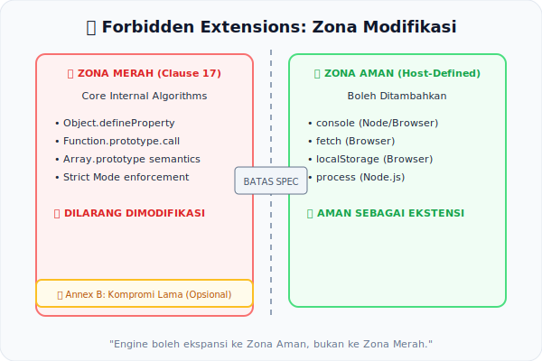

# CH-05: Forbidden Extensions

*Pemetaan ECMA-262: Clause 17 (Forbidden Extensions)*

Meskipun ECMA-262 memberikan kebebasan bagi *Host* untuk menambah fitur (seperti `console`), spesifikasi juga menetapkan "Garis Merah" yang tidak boleh dilanggar oleh siapapun. Inilah **Forbidden Extensions**.

## Mental Model: "Zona Merah pada Peta Modifikasi"
Bayangkan spesifikasi adalah aturan keamanan jalan raya. Anda boleh memodifikasi mobil (Engine/Host) dengan aksesori yang lebih keren. Tapi, ada **Papan Larangan** besar di pintu bengkel:
- ❌ Dilarang mengubah cara rem bekerja.
- ❌ Dilarang mengganti fungsi lampu merah.

Papan larangan inilah yang disebut *Forbidden Extensions*. Alasannya sederhana: modifikasi berbahaya akan merusak kepercayaan pengemudi lain (developer) yang menganggap aturan adalah konstan.

---

## 1. Menjaga Kontrak Bahasa (Clause 17)
Tujuan dari *Forbidden Extensions* adalah memastikan bahwa kode yang valid menurut spesifikasi standar **tidak akan berperilaku berbeda** di mesin yang memiliki ekstensi vendor. Ini menjamin **portabilitas** kode di seluruh ekosistem JavaScript.

## 2. Larangan Utama dalam Spec
Berdasarkan Clause 17, Engine JavaScript **DILARANG**:
- **Ekstensi Sintaksis**: Menambah sintaks baru yang membuat program standar menjadi tidak valid.
- **Modifikasi Semantik**: Mengubah algoritma internal yang sudah didefinisikan spec (misal: cara `Object.defineProperty` bekerja).
- **Penambahan ke Objek Global**: Menambahkan properti dengan nama yang bisa bentrok dengan fitur masa depan spec.
- **Strict Mode Bypass**: Fitur yang memperbolehkan pelanggaran aturan *Strict Mode*.

## 3. Kompromi: Annex B
Beberapa ekstensi yang secara teknis melanggar aturan ini tetap diizinkan melalui **Annex B** demi kompatibilitas web lawas. Fitur ini bersifat opsional bagi engine non-browser (Node.js) tapi wajib bagi browser.

---

## Arsitek Mindset: Portabilitas & Masa Depan
Sebagai arsitek, waspadai fitur "Non-Standard" dari runtime tertentu. Jika fitur tersebut berada di area *Forbidden Extensions*, ia berpotensi menghambat migrasi atau menyebabkan perilaku tak terduga saat spec mengadopsi nama yang sama di masa depan.

---

## Referensi Terkait
- [ECMA-262 Clause 17 - Forbidden Extensions](https://tc39.es/ecma262/#sec-forbidden-extensions)
- [ECMA-262 Annex B - Legacy Extensions](https://tc39.es/ecma262/#sec-additional-ecmascript-features-for-web-browsers)

---
> [!TIP]  
> Jelajahi simulasi deteksi penggunaan fitur non-standar yang berbahaya di [examples/forbidden_check_sim.js](./examples/forbidden_check_sim.js).
