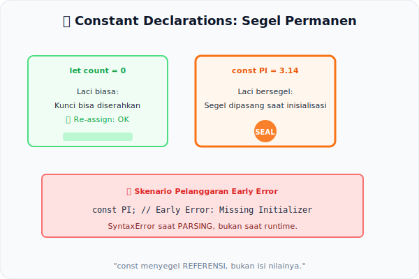

# CH-06: Constant Declarations

*Pemetaan ECMA-262: Clause 14.3.1.1 (Static Semantics: Early Errors)*

Keyword `const` sering dianggap hanya sebagai "variabel yang tidak bisa diubah". Namun di mata spesifikasi, ada mekanisme yang jauh lebih dalam: sebuah sistem **Immutable Binding** yang diperkuat sejak fase analisis statis.

## Mental Model: "Segel Permanen pada Laci"
Saat Anda mendeklarasikan variabel dengan `var` atau `let`, Anda membuat sebuah laci yang kuncinya bisa diberikan ke siapa saja (boleh diisi ulang). Namun, saat Anda menggunakan `const`, spesifikasi memasang **Segel Permanen** pada laci tersebut sejak saat pertama dibuat.

Analisis statis bertugas memastikan dua hal:
1. **Segel Harus Langsung Dipasang**: Laci `const` wajib langsung diisi (Inisialisasi adalah wajib).
2. **Tidak Ada Rencana untuk Merusak Segel**: Jika Anda menulis kode yang akan mencoba mengisi ulang, alarm langsung berbunyi.

---

## 1. Aturan Wajib Inisialisasi (Clause 14.3.1.1)
Berdasarkan Early Error rules, sebuah `LexicalDeclaration` menggunakan `const` **harus** memiliki `Initializer`.
- **Valid**: `const PI = 3.14;`
- **Invalid**: `const PI;` ← **SyntaxError** di fase parsing — bukan runtime!

## 2. Immutable Binding vs Immutable Value
Ini adalah perbedaan krusial:
- **Immutable Binding**: "Alamat" (referensi) dari binding tidak dapat diubah setelah inisialisasi. Inilah jaminan `const`.
- **Immutable Value**: Isi nilai itu sendiri. `const obj = {}` tidak mencegah `obj.x = 1`, karena yang di-seal adalah *referensi ke objek*, bukan *isi objek*.

---

## Arsitek Mindset: Predictability through Constancy
Penggunaan `const` yang konsisten membantu mesin JS melakukan optimasi seperti *Constant Folding* — mesin tahu secara statis bahwa binding ini tidak akan berpindah, sehingga bisa mengasumsikan stabilitas referensi tersebut.

---

## Referensi Terkait
- [ECMA-262 Clause 14.3.1 - Let and Const Declarations](https://tc39.es/ecma262/#sec-let-and-const-declarations)

---
> [!TIP]  
> Pelajari perbedaan binding vs value immutability dalam simulasi di [examples/const_binding_demo.js](./examples/const_binding_demo.js).
