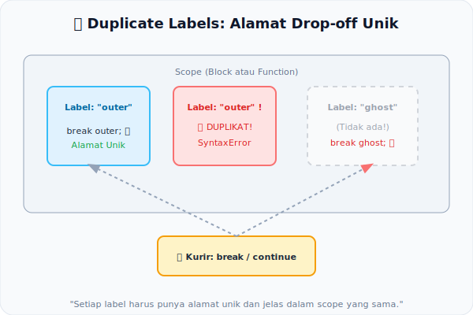

# CH-07: Duplicate Labels and Jump Targets

*Pemetaan ECMA-262: Clause 14.15 (Labelled Statements)*

Dalam JavaScript, kita bisa memberikan "Nama Jalan" pada blok kode atau perulangan menggunakan label. Namun, spesifikasi sangat ketat dalam mengatur bagaimana label ini boleh digunakan — terutama karena label memungkinkan "lompatan" kode yang bisa menjadi kacau jika tidak dikontrol.

## Mental Model: "Alamat Drop-off yang Unik"
Bayangkan Anda adalah seorang kurir (`break` atau `continue`). Anda harus mengantarkan paket ke sebuah alamat (Label).
- Jika ada **dua rumah dengan alamat yang sama** di satu jalan, Anda akan bingung. → **Early Error: Duplicate Label**
- Jika Anda disuruh mengantar paket ke **alamat yang tidak ada** dalam peta, Anda juga akan protes. → **Early Error: Undefined Jump Target**

Tanpa aturan ini, kode bisa "berjalan kacau" ke lokasi yang tidak terduga.

---

## 1. Aturan Statis `LabelledStatement`
Setiap kali label didefinisikan, mesin menjalankan algoritma **Static Semantics: ContainsDuplicateLabels**. Jika sebuah label didefinisikan di dalam statement yang sudah memiliki label dengan nama yang sama dalam scope yang sama, mesin akan melempar `SyntaxError` seketika.

## 2. Validasi Jump Target
Mesin juga menvalidasi target dari `break` dan `continue` menggunakan dua algoritma:
- **`ContainsUndefinedBreakTarget`**: Apakah label yang ditarget oleh `break` benar-benar ada di scope luar?
- **`ContainsUndefinedContinueTarget`**: Apakah target label dari `continue` adalah sebuah **iterasi** (for, while, do-while)?

`continue` hanya boleh menargetkan statement perulangan, tidak boleh ke blok biasa.

## 3. Batasan Scope Label
Label memiliki scope yang terbatas pada statement yang mendahuluinya secara leksikal. Tidak bisa melompat ke label di fungsi lain atau di luar lingkup leksikal.

---

## Arsitek Mindset: Kontrol Alur yang Aman
Fitur label jarang digunakan dalam kode modern, namun memahami aturannya membantu Anda mengerti bagaimana **Control Flow** di JavaScript diamankan secara statis agar terhindar dari lompatan kode yang tidak terstruktur (*Spaghetti Code*).

---

## Referensi Terkait
- [ECMA-262 Clause 14.15 - Labelled Statements](https://tc39.es/ecma262/#sec-labelled-statements)

---
> [!TIP]  
> Uji validasi label duplikat dan target yang tidak ada dalam simulasi di [examples/label_jump_sim.js](./examples/label_jump_sim.js).
