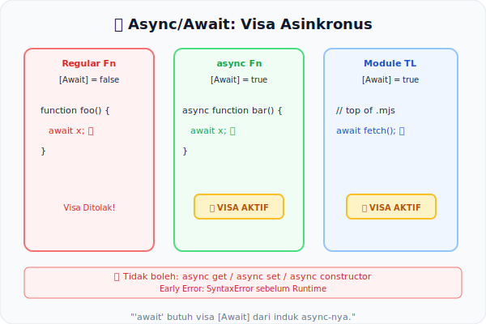

# CH-08: Async/Await Restrictions

*Pemetaan ECMA-262: Clause 15.8 (Async Function Definitions)*

Keyword `async` dan `await` terlihat sederhana, namun di balik layar spesifikasi harus melakukan analisis statis yang cermat untuk memastikan mereka tidak disalahgunakan. `await` adalah konteks-sensitif: validitasnya bergantung sepenuhnya pada "kawasan" di mana ia ditulis.

## Mental Model: "Visa Asinkronus"
Bayangkan `await` adalah sebuah visa perjalanan khusus. Anda hanya boleh menggunakan visa ini jika paspor Anda (Fungsi induk) sudah dicap sebagai `async`. 
- Fungsi `async` adalah **kawasan bervisa** yang mengaktifkan parameter grammar `[Await]`.
- Fungsi biasa adalah **kawasan tanpa visa** — `await` menjadi identifier biasa atau langsung memicu error.
- Petugas imigrasi (Static Semantics) akan menolak Anda di gerbang jika visanya tidak ada.



---

## 1. Konteks [Await] pada Grammar (Kaitan dengan BK-02)
Spesifikasi menggunakan parameter grammar `[Await]` untuk membawa status asinkronus dari atas ke bawah pohon AST.
- Saat fungsi dideklarasikan dengan `async`, seluruh isi di dalamnya memiliki flag `[Await]` aktif.
- Di wilayah berflag `[Await]`, `await` adalah token valid (kata kunci).
- Di wilayah tanpa flag, `await` dianggap identifier biasa (atau dilarang di ESM top-level).

## 2. Top-Level Await di Modul
Di dalam ECMAScript Module (ESM), keyword `await` adalah **Reserved Word** di level top-level secara alami, memungkinkan fitur *Top-Level Await* — sebuah izin khusus yang diberikan spec di level `ModuleBody`.

## 3. Early Error: Async Getter/Setter
Salah satu aturan statis yang sering dilupakan: **Getter dan Setter tidak boleh bersifat `async`**.
```javascript
let obj = {
  async get data() { ... } // EARLY ERROR: SyntaxError
};
```
Karena akses properti haruslah instan secara arsitektur, menjadikannya asinkron merusak model mental objek.

---

## Arsitek Mindset: Context-aware Syntax
`await` bukan sekadar fungsi — ia adalah **pengubah perilaku parser** yang dikunci oleh konteks. Memahami batasan statis ini mencegah Anda mencoba pola-pola "ajaib" yang dilarang bahasa, dan mengarahkan ke arsitektur yang lebih benar (misal: *Static Factory Method* untuk konstruktor asinkron).

---

## Referensi Terkait
- [ECMA-262 Clause 15.8 - Async Function Definitions](https://tc39.es/ecma262/#sec-async-function-definitions)

---
> [!TIP]  
> Lihat bagaimana parameter `[Await]` mengubah validitas node secara statis dalam simulasi di [examples/async_context_sim.js](./examples/async_context_sim.js).
