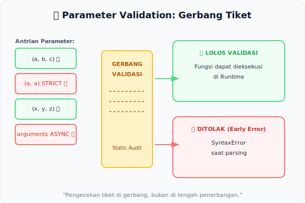

# CH-09: Parameter Validation

*Pemetaan ECMA-262: Clause 15.1 (Function Definitions) — Static Semantics*

Kapan JavaScript menolak parameter yang tidak valid? Bukan saat fungsi dipanggil—melainkan saat kode dibaca! Itulah kekuatan **Static Semantics** dalam validasi parameter.

## Mental Model: "Pemeriksaan Tiket Penumpang"
Bayangkan Anda ingin naik pesawat. Petugas memverifikasi tiket Anda *sebelum* Anda masuk ke gerbang (bukan di tengah penerbangan):
- Tidak boleh ada penumpang dengan **kursi duplikat** pada penerbangan yang sama.
- Di penerbangan "bisnis" tertentu (Strict Mode / Generator / Async), tiket standar (`arguments`, parameter non-unik) tidak diperbolehkan.

Pengecekan ini dilakukan oleh spec sejak fase parsing, bukan runtime.



---

## 1. Aturan Parameter Duplikat
Secara default (tidak strict), fungsi biasa mengizinkan parameter dengan nama yang sama:
```javascript
// Non-strict: DIIZINKAN (tapi berbahaya)
function test(a, a) { return a; }
```
Namun di **Strict Mode**, fungsi dengan parameter duplikat akan memicu **Early Error** langsung:
```javascript
"use strict";
function test(a, a) { } // SyntaxError!
```
Hal ini juga berlaku pada **Arrow Functions** dan **Destructuring Parameters** — keduanya selalu berperilaku seperti strict mode.

## 2. `arguments` dan Generator/Async
Di dalam **Generator Function** atau **Async Function**, menggunakan `arguments` sebagai **nama parameter** adalah Early Error. Kata ini dilindungi dalam konteks tersebut karena memiliki makna semantik yang berbeda.

## 3. Destructured Parameter vs Simple
Spesifikasi membedakan antara **Simple Parameter List** (misal: `(a, b)`) dan **Complex Parameter List** (misal: `([a, b]) atau ({x})`) karena keduanya memiliki aturan semantik statis yang berbeda. Fungsi dengan parameter kompleks tidak boleh menggunakan `"use strict"` di body-nya!

---

## Arsitek Mindset: Fail Fast, Fail Safely
Validasi parameter adalah contoh ideal dari prinsip *Fail Fast*. Mesin menolak konfigurasi parameter ilegal sejak dini, memastikan tidak ada state yang terkontaminasi sebelum fungsi bahkan sempat dipanggil.

---

## Referensi Terkait
- [ECMA-262 Clause 15.1 - Function Definitions](https://tc39.es/ecma262/#sec-function-definitions)

---
> [!TIP]  
> Uji berbagai skenario validasi parameter — dari duplikat hingga strict mode — dalam simulasi di [examples/param_validation_sim.js](./examples/param_validation_sim.js).
