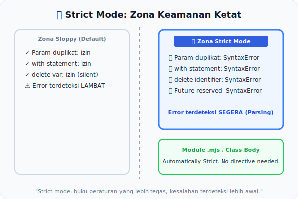

# CH-10: Strict Mode Semantics

*Pemetaan ECMA-262: Clause 11.2 (Strict Mode Code)*

**Strict Mode** bukan sekadar "flag keamanan". Dari sudut pandang spesifikasi, mengaktifkan Strict Mode mengubah aturan semantik statis yang berlaku pada kode tersebut secara fundamental. Mesin membaca "kawasan strict" dengan buku peraturan yang berbeda.

## Mental Model: "Zona Keamanan Ketat"
Bayangkan sebuah gedung perkantoran. Di lantai biasa, karyawan bisa masuk melalui pintu mana saja, duduk di kursi mana saja, dan membuat sedikit keributan. Namun, ada **Zona Aman** (Strict Mode) di lantai tertentu yang mengharuskan:
- Setiap orang menunjukkan identitas (tidak ada variabel tanpa deklarasi).
- Tidak ada tamu yang masuk melalui pintu rahasia (`with` statemen dilarang).
- Setiap barang harus punya label (`delete` pada variabel dilarang).

Aturan zona ketat ini sudah dipasang di papan pintu — bukan setelah seseorang masuk.

---

## 1. Cara Mengaktifkan Strict Mode
Strict Mode diaktifkan oleh direktif `"use strict"` atau secara otomatis dalam:
- **Modul ES** (seluruh kode modul adalah strict).
- **Class bodies** (seluruh isi class adalah strict).

## 2. Perubahan Semantik Statis yang Ter-trigger
Beberapa hal yang berubah secara **statis** (Early Error baru):
- Nama parameter duplikat → **SyntaxError**.
- Penggunaan `with` statement → **SyntaxError**.
- `delete` pada identifier yang tidak deletable → **SyntaxError**.
- Nama tertentu (`implements`, `interface`, `let`, `package`, `private`, `protected`, `public`, `static`, `yield`) menjadi reserved words.

## 3. Perubahan Semantik Runtime
Strict Mode juga mengubah beberapa perilaku runtime (namun itu di luar scope bab ini):
- `this` di fungsi biasa menjadi `undefined` (bukan global object).
- `arguments` tidak lagi sinkron dengan parameter.

---

## Arsitek Mindset: Opt-in to Discipline
Strict Mode adalah cara JavaScript mengizinkan developer "upgrade" ke set aturan yang lebih aman dan dapat diprediksi. Memahami perbedaan statis vs runtime dari strict mode membantu Anda mengaudit kode warisan (*legacy code*) secara lebih akurat.

---

## Referensi Terkait
- [ECMA-262 Clause 11.2 - Strict Mode Code](https://tc39.es/ecma262/#sec-strict-mode-code)

---
> [!TIP]  
> Lihat perbedaan aturan yang aktif antara strict dan non-strict mode dalam simulasi di [examples/strict_mode_sim.js](./examples/strict_mode_sim.js).
