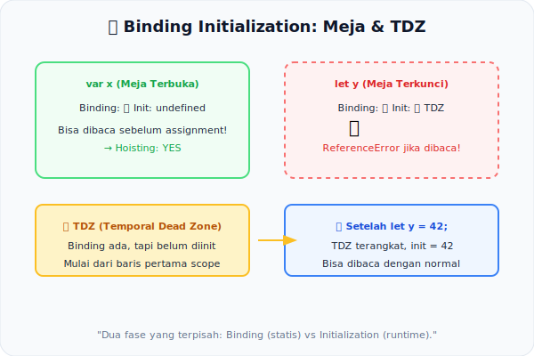

# CH-11: Binding Initialization

*Pemetaan ECMA-262: Clause 8.6 (Runtime Semantics: BindingInitialization) & Static Semantics*

Sebelum program berjalan, setiap deklarasi variabel melalui dua tahap yang terpisah: **Binding** (registrasi nama) dan **Initialization** (pemberian nilai awal). Memahami perbedaan ini adalah kunci untuk memahami "Temporal Dead Zone" (TDZ).

## Mental Model: "Meja Kosong Menunggu Pendeklarasian"
Saat mesin membaca blok kode, ia pertama-tama menyiapkan **meja-meja kosong** (Bindings) untuk semua variabel yang terdeteksi secara statis. Meja-meja ini sudah ada namanya, tapi **kosong** dan **terkunci** sebelum kode di barisnya mencapai.

- `var`: Mejanya disetting dan langsung diberi nilai `undefined` (tidak terkunci).
- `let` / `const`: Mejanya disetting tapi **terkunci** sampai baris deklarasinya dieksekusi. Area antara binding dan initialization inilah yang disebut **TDZ (Temporal Dead Zone)**.

---

## 1. Static Semantics: BoundNames
Tahap pertama (fase statis) mengumpulkan semua **BoundNames** dalam scope. Ini dilakukan sebelum eksekusi dimulai. Semua nama `let`, `const`, dan `var` dikumpulkan dalam daftar yang digunakan untuk menyiapkan Environment Record.

## 2. Phase Binding vs Initialization
| Fase | `var` | `let` / `const` |
|------|-------|-----------------|
| Binding (Statis) | Didaftarkan + `undefined` | Didaftarkan + **LOCKED** |
| Initialization (Runtime) | Otomatis saat binding | Saat baris deklarasi tercapai |
| TDZ | Tidak ada | Ada |

## 3. Destructuring & Complex Patterns
Destructuring declaration (`const { x, y } = obj`) memiliki proses binding initialization yang lebih kompleks karena setiap property harus di-match dan di-bind secara terpisah. Ini menggunakan `BindingInitialization` algorithm rekursif dari spec.

---

## Arsitek Mindset: The Two-Phase Mental Model
Memahami pemisahan binding dan initialization membantu Anda menjelaskan perilaku hoisting (`var` vs `let/const`), mengaudit bug TDZ, dan menulis kode yang lebih prediktif. Ini adalah salah satu konsep paling fundamental dalam JavaScript.

---

## Referensi Terkait
- [ECMA-262 Clause 8.6 - Runtime Semantics: BindingInitialization](https://tc39.es/ecma262/#sec-runtime-semantics-bindinginitialiation)

---
> [!TIP]  
> Amati perbedaan antara `var` hoisting dan TDZ untuk `let/const` dalam simulasi di [examples/binding_init_sim.js](./examples/binding_init_sim.js).
