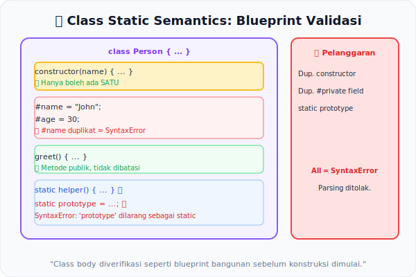

# CH-12: Class Static Semantics

*Pemetaan ECMA-262: Clause 15.7 (Class Definitions)*

Kelas di JavaScript jauh lebih dari sintaksis *syntactic sugar* untuk prototype. Di balik keyword `class`, terdapat serangkaian aturan semantik statis yang sangat tegas men-*guard* penggunaan private field, metode statis, dan konstruktor agar arsitektur kelas tetap bersih dan aman.

## Mental Model: "Cetak Biru Gedung Bertingkat"
Bayangkan sebuah `class` adalah cetak biru (blueprint) sebuah gedung kantor. Sebelum gedung dibangun (*Runtime*), arsitek harus memverifikasi:
- Tidak ada dua **ruangan privat** dengan nama yang sama di gedung yang sama.
- **Lobis** (constructor) hanya boleh ada satu dan tidak punya akses `super()` kecuali di gedung yang memang merupakan cabang dari gedung lain.
- **Aula Umum** (public static) tidak boleh bernama `prototype` — karena itu sudah menjadi jalur sirkulasi bawaan.

Petugas verifikasi (Static Semantics) memeriksa seluruh blueprint sebelum pembangunan dimulai.



---

## 1. Aturan Nama Private
Di dalam sebuah class, setiap **Private Name** (`#field`) harus unik. Spesifikasi menggunakan `PrivateBoundIdentifiers` (SDO statis) untuk mengumpulkan dan memvalidasi semua nama private dalam class body.
```javascript
class C {
  #x = 1;
  #x = 2; // Early Error: SyntaxError!
}
```

## 2. Aturan Constructor
Sebuah `class` hanya boleh memiliki **satu** `constructor`. Mencoba mendefinisikan dua constructor adalah Early Error. Selain itu, `constructor` pada subclass yang tidak memanggil `super()` sebelum mengakses `this` akan menyebabkan error runtime (meski beberapa aspeknya dicek secara statis).

## 3. Larangan Static Prototype
Property `static prototype` pada class body adalah Early Error — karena `prototype` adalah jalur warisan yang sudah dikunci oleh spesifikasi dan tidak boleh di-override secara statis.

---

## Arsitek Mindset: Structure Guarantees Correctness
Class Static Semantics adalah contoh terbaik dari prinsip "Structure Guarantees Correctness". Aturan yang diterapkan di fase statis mencegah class definitions yang ambigu atau tidak konsisten, sehingga setiap *instance* yang dibuat selalu berada dalam kondisi yang valid.

---

## Referensi Terkait
- [ECMA-262 Clause 15.7 - Class Definitions](https://tc39.es/ecma262/#sec-class-definitions)

---
> [!TIP]  
> Jelajahi validasi aturan class — dari private field duplikat hingga static prototype — dalam simulasi di [examples/class_static_sim.js](./examples/class_static_sim.js).
