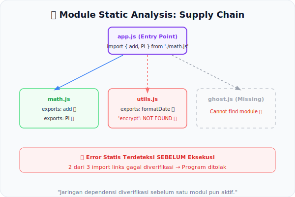

# CH-13: Module Static Analysis

*Pemetaan ECMA-262: Clause 16.2 (Modules)*

ECMAScript Modules (ESM) bukan sekadar mekanisme impor/ekspor. Mereka adalah unit analisis yang ketat, di mana jaringan dependensi antar modul diperiksa, dijahit, dan diverifikasi secara **statis** sebelum satu pun kode dieksekusi.

## Mental Model: "Peta Impor Ekspor (Supply Chain)"
Bayangkan seluruh program Anda adalah jaringan gudang (**modul**) yang saling mengirim dan menerima barang (**binding**). Sebelum operasional dimulai:
- Setiap permintaan impor dicek: apakah gudang sumber **memang mengekspor** item tersebut?
- Apakah ada **pengiriman melingkar** (circular dependency) yang akan memblokir operasional?
- Apakah asal dan tujuan barang sudah jelas dan tidak ambigu?

Seluruh "verifikasi rantai pasok" ini dilakukan oleh engine sebelum satu baris pun `run`.



---

## 1. Static Linking: Import Resolution
Saat engine menemukan `import { x } from './mod.js'`, ia tidak langsung menjalankan `mod.js`. Melainkan, secara statis ia membangun **Module Graph** — sebuah peta dari semua modul yang saling bergantung. Setiap link diverifikasi: apakah `x` memang di-ekspor dari `mod.js`?

Jika tidak, engine melempar `SyntaxError` (atau `ReferenceError` yang setara) sebelum eksekusi.

## 2. Named Export Validation
Di sisi pengirim, spec memvalidasi bahwa semua `export` sudah dideklarasikan dengan benar. Mengekspor nama yang tidak ada adalah Early Error:
```javascript
export { ghost }; // Early Error jika 'ghost' tidak dideklarasikan di modul ini
```

## 3. Circular Dependencies
Circular dependency diizinkan oleh ESM (berbeda dengan CommonJS yang lebih rapuh), tetapi engine harus membangun grafik yang benar agar binding yang tersedia diketahui di setiap siklus. Ini adalah kerja analisis statis yang berat.

---

## Arsitek Mindset: Transparent Dependencies
Module Static Analysis membuat alur dependensi menjadi **transparan** dan **dapat diprediksi**. Berbeda dengan `require()` dinamis, `import` statis memungkinkan bundler dan engine untuk tree-shaking, optimasi, dan deteksi error lebih awal.

---

## Referensi Terkait
- [ECMA-262 Clause 16.2 - Modules](https://tc39.es/ecma262/#sec-modules)

---
> [!TIP]  
> Simulasikan resolusi import statis dan deteksi ekspor yang tidak valid dalam [examples/module_link_sim.js](./examples/module_link_sim.js).
