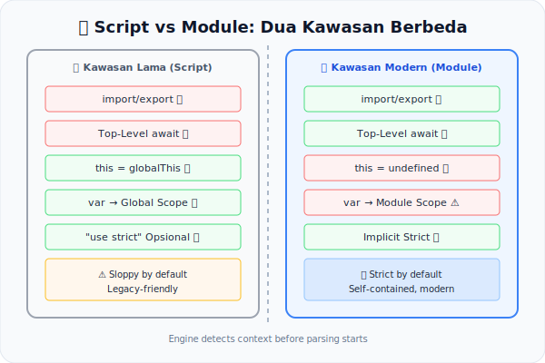

# CH-14: Script vs Module — The Static Divide

*Pemetaan ECMA-262: Clause 16.1 (Scripts) & Clause 16.2 (Modules)*

JavaScript dapat dijalankan dalam dua "mode pembungkus" yang mendasar: sebagai **Script** biasa atau sebagai **ES Module**. Perbedaan di antara keduanya bukan sekadar preferensi sintaksis — melainkan berimplikasi besar pada aturan semantik statis yang berlaku.

## Mental Model: "Dua Zona Berbeda di Satu Kota"
Bayangkan sebuah kota dengan dua kawasan berbeda:
- **Kawasan Lama (Script)**: Aturan lebih longgar. Orang bisa keluar masuk tanpa identitas (tanpa deklarasi ketat), dan setiap orang saling berbagi ruang publik (global scope).
- **Kawasan Modern (Module)**: Memiliki identitas wajib (setiap ekspor harus jelas), pintu-pintu privat, dan warga tidak bisa sembarangan masuk ke area orang lain (modul bersifat *self-contained*).

Mesin JS harus mengetahui Anda berada di kawasan mana **sebelum** menentukan aturan apa yang berlaku.

---

## 1. Perbedaan Utama Secara Statis
| Fitur | Script | Module |
|-------|--------|--------|
| `"use strict"` | Opsional | Otomatis (implisit) |
| Top-Level `await` | ❌ Error | ✅ Valid |
| Deklarasi `import`/`export` | ❌ Error | ✅ Valid |
| `this` di top-level | `globalThis` | `undefined` |
| Scope variabel top-level | Global | Modul (terisolasi) |

## 2. Deteksi Mode oleh Mesin
Mesin JavaScript menentukan mode dari konteksnya:
- Browser: `<script type="module">` vs `<script>`
- Node.js: Ekstensi `.mjs` atau `"type": "module"` di `package.json`

Deteksi ini terjadi sebelum parsing, sehingga aturan semantik statis yang berbeda langsung diterapkan.

## 3. Implikasi TLA (Top-Level Await)
`await` di top-level hanya valid di Module karena spesifikasi memperlakukan Module body sebagai fase yang imiplisit bersifat async (seperti berada di dalam fungsi async). Di Script, ini selalu Early Error.

---

## Arsitek Mindset: Know Your Context
Memahami divisi Script vs Module adalah dasar untuk debugging environment issues, memilih bundler configuration yang tepat, dan memahami mengapa kode yang sama berperilaku berbeda di konteks yang berbeda.

---

## Referensi Terkait
- [ECMA-262 Clause 16.1 - Scripts](https://tc39.es/ecma262/#sec-scripts)
- [ECMA-262 Clause 16.2 - Modules](https://tc39.es/ecma262/#sec-modules)

---
> [!TIP]  
> Lihat perbandingan aturan statis yang aktif dalam Script vs Module dalam simulasi di [examples/script_vs_module_sim.js](./examples/script_vs_module_sim.js).
