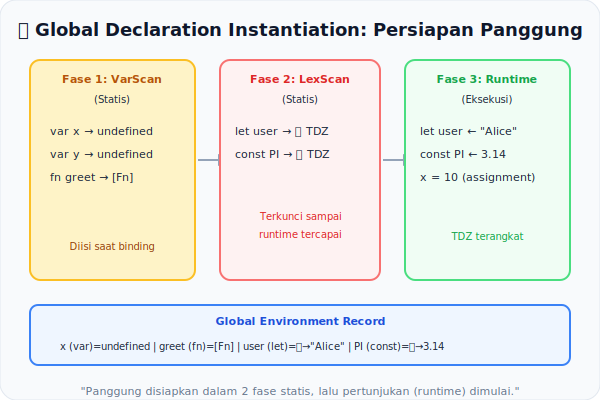

# CH-15: Global Declaration Instantiation

*Pemetaan ECMA-262: Clause 16.1.7 (GlobalDeclarationInstantiation)*

Sebelum satu baris script berjalan, mesin JavaScript melakukan "scan awal" menyeluruh pada seluruh blok kode untuk mendaftarkan variabel dan fungsi ke dalam memori. Proses inilah yang disebut **Global Declaration Instantiation** — panggung disiapkan sebelum pertunjukan dimulai.

## Mental Model: "Persiapan Panggung Sebelum Pertunjukan"
Sebelum drama dimulai, kru panggung (**engine**) melakukan:
1. **Membaca seluruh skrip** terlebih dahulu — bukan baris per baris, seluruhnya.
2. **Mendirikan dekorasi** (`var` dan `function` declarations didaftarkan ke Global Environment Record).
3. **Memasang properti kelas** (`let`, `const`, `function` declarations — tapi dalam kondisi terkunci / TDZ).
4. Barulah lampu sorot menyala dan **aktor memulai aksi** (eksekusi runtime).

Proses "setup" ini adalah statik-persyaratan yang memungkinkan hoisting terjadi.

---

## 1. Algoritma GlobalDeclarationInstantiation
Spesifikasi mendefinisikan langkah-langkah yang terurut:
1. Jalankan `VarDeclaredNames` pada seluruh script untuk mengumpulkan semua nama `var`.
2. Untuk setiap nama, buat sebuah **Global Variable Binding** bertipe `mutable-uninitialized` → diisi `undefined`.
3. Jalankan `LexicallyDeclaredNames` untuk nama `let`, `const`, `class` — buat binding yang **LOCKED**.
4. Inisialisasi semua `FunctionDeclaration` ke nilai fungsinya (ini mengapa fungsi bisa dipanggil bahkan sebelum dideklarasikan).

## 2. Konflik Antara `var` dan Lexical
Jika sebuah nama ada di kedua daftar (VarDeclaredNames dan LexicallyDeclaredNames) di scope global, ini adalah **Early Error**. Mesin tidak akan melanjutkan instantiation.

## 3. Hoisting: Konsekuensi Logis
Hoisting bukan "fitur ajaib" JavaScript. Ia adalah konsekuensi langsung dari proses dua-fase ini: **Binding** (setup panggung / statis) terjadi sebelum **Initialization & Execution** (pertunjukan / runtime).

---

## Arsitek Mindset: The Hidden First Pass
Menyadari bahwa interpreter melakukan "pass pertama" sebelum eksekusi membantu Anda memahami urutan yang benar untuk mendeklarasikan fungsi utilitas, memahami TDZ secara mendalam, dan menghindari bug halus yang berhubungan dengan urutan deklarasi.

---

## Referensi Terkait
- [ECMA-262 Clause 16.1.7 - GlobalDeclarationInstantiation](https://tc39.es/ecma262/#sec-globaldeclarationinstantiation)

---
> [!TIP]  
> Amati urutan pendaftaran variabel dan fungsi yang terjadi sebelum eksekusi dalam simulasi di [examples/global_decl_sim.js](./examples/global_decl_sim.js).
