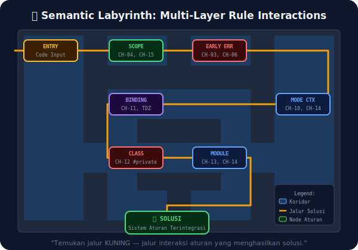

# CH-16: Advanced Semantic Puzzles

*Pemetaan ECMA-262: Sintesis dari Clause 5, 11, 14, 15, dan 16*

Setelah mempelajari 15 bab tentang Static Semantic Rules, saatnya menghadapi **tantangan sintesis**: skenario kode yang membutuhkan pemahaman mendalam tentang interaksi antara beberapa aturan statis secara bersamaan.

## Mental Model: "Labirin Multi-Tingkat"
Setiap teka-teki di bab ini adalah sebuah labirin multi-tingkat. Setiap dinding labirin adalah aturan statis yang telah kita pelajari. Untuk menemukan jalan keluar (memahami error atau perilaku), Anda harus menelusuri setiap lapisan aturan: Scope → Early Error → Binding → Mode → Context.

Seorang arsitek yang baik tidak hanya hafal setiap per aturan, tetapi tahu **cara aturan-aturan itu berinteraksi satu sama lain**.



---

## Teka-Teki 1: TDZ vs Hoisting Bertabrakan
```javascript
let x = 1;
function test() {
  console.log(x); // ← Apa yang terjadi? ReferenceError atau 1?
  let x = 2;
}
test();
```
**Jawaban**: **ReferenceError (TDZ)**. `let x` di dalam fungsi membuat binding baru di scope fungsi. Binding ini ada (BoundNames scan menemukan `x`), tapi belum diinisialisasi saat `console.log` dieksekusi. `x` dari scope luar tidak bisa diakses karena scope dalam "menutupinya" dengan TDZ.

---

## Teka-Teki 2: Strict Mode yang Mengubah Rules
```javascript
(function() {
  "use strict";
  var a = 1;
  let a = 2; // ← Early Error atau Runtime Error?
})();
```
**Jawaban**: **Early Error (SyntaxError)** di fase parsing. `var a` dan `let a` di dalam scope fungsi yang sama adalah konflik yang terdeteksi secara statis oleh `LexicallyDeclaredNames` check — jauh sebelum eksekusi.

---

## Teka-Teki 3: Class Private yang Rumit
```javascript
class A {
  #x = 1;
  getX() { return this.#x; }
}
class B extends A {
  #x = 2; // ← Boleh atau tidak?
  getOwnX() { return this.#x; }
}
```
**Jawaban**: **Boleh (Valid)**. `#x` di kelas `A` dan `#x` di kelas `B` adalah **Private Names yang berbeda**. Mereka tidak pernah bertabrakan karena scope-nya adalah kelas masing-masing. Hanya duplikasi di dalam kelas yang sama yang menyebabkan Early Error.

---

## Arsitek Mindset: Sistem Aturan, Bukan Hanya Aturan
Tantangan-tantangan ini mengajarkan bahwa memahami JavaScript di level spec sama artinya dengan memahami sebuah **sistem aturan yang saling berinteraksi**, bukan sekadar memorisasi aturan-aturan individual.

---

## Referensi Terkait
- [ECMA-262 Clause 5.2 - Algorithm Conventions](https://tc39.es/ecma262/#sec-algorithm-conventions)
- [MindMap: BK-04 Static Semantic Rules](../docs/contents.md)

---
> [!TIP]  
> Uji pemahaman Anda dan lihat penjelasan algoritmik dari ketiga teka-teki di atas dalam simulasi di [examples/semantic_puzzles.js](./examples/semantic_puzzles.js).
