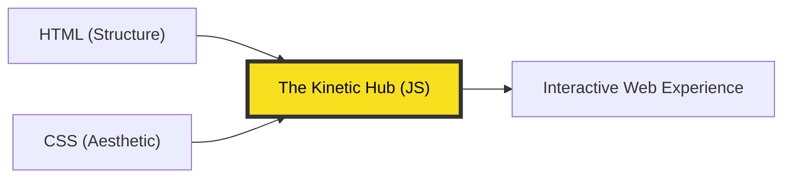

# CH-01: Introduction to the Web Energy

> **"JavaScript is the Kinetic Hub that turns a static document into a living experience."**

Selamat datang di langkah pertama Anda. Sebelum menulis kode yang rumit, Anda harus memahami di mana posisi JavaScript dalam ekosistem web.

## 1. Analogi: Arsitektur vs Energi Kinetik

Bayangkan web sebagai sebuah **Pusat Energi (Energy Hub)**:
- **HTML**: Adalah **Struktur Fisik** (Gedung, Tiang, Kabel). Tanpa HTML, tidak ada tempat untuk menyimpan energi.
- **CSS**: Adalah **Estetika & Identitas** (Warna gedung, Tata lampu). Tanpa CSS, gedung tersebut terlihat membosankan.
- **JavaScript**: Adalah **Energi Kinetik**. Ia adalah arus listrik yang mengalir di kabel, motor yang memutar turbin, dan logika yang menyalakan lampu saat ada orang lewat.

---

## 2. Mental Model: The Web's Kinetic Hub

JavaScript bertindak sebagai "lem" yang menyatukan seluruh elemen. Ia merespons kejadian (events), mengubah tampilan secara real-time, dan berkomunikasi dengan dunia luar.

---

## 3. Mengapa Menggunakan JavaScript?

Di era modern, JavaScript bukan lagi sekadar bahasa untuk membuat navigasi bergerak (carousel) atau tombol yang berubah warna. JavaScript adalah **Bahasa Universal**:
1. **Dinamis**: Konten bisa berubah tanpa harus me-refresh halaman (AJAX/Fetch).
2. **Versatile**: Bisa dijalankan di Browser, Server (Node.js), bahkan Robotika.
3. **Event-Driven**: JavaScript "mendengarkan" apa yang dilakukan pengguna (Klik, Scroll, Ketik) dan segera memberikan respons.

---

## Arsitek Mindset: Membangun dengan Energi

Sebagai arsitek, tugas Anda bukan hanya menumpuk kode, tapi memastikan "energi" mengalir secara efisien. Jangan menggunakan JavaScript untuk sesuatu yang bisa diselesaikan oleh CSS (misal: hover sederhana). Gunakan JavaScript untuk **Logika, Interaksi, dan Transformasi Data**.

---

## Contoh Sederhana
Lihat file `examples/energy_demo.js` untuk melihat bagaimana kita bisa mengaktifkan "energi" pada sebuah data sederhana.

---
*Status: [status.md](../../../../status.md)*
