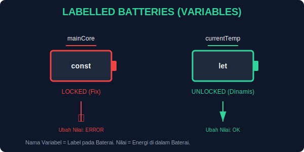

# CH-02: The Variables (Energy Storage)

> **"Jika JavaScript adalah energi kinetik, maka Variabel adalah baterai tempat kita menyimpannya."**

Dalam bab sebelumnya, kita belajar bahwa JavaScript menghidupkan web. Namun, energi tersebut perlu disimpan dan diberi label agar bisa digunakan kembali. Di sinilah **Variabel** berperan.

## 1. Mental Model: "Baterai Berlabel"

Bayangkan Anda memiliki gudang berisi baterai. Tanpa label, Anda tidak tahu baterai mana yang berisi daya untuk lampu, dan mana yang untuk robot.
- **Label (Nama Variabel)**: Nama yang Anda berikan (misal: `energyLevel`).
- **Daya (Nilai Variabel)**: Data yang disimpan di dalamnya (misal: `100`).

---

## 2. Tiga Jenis Penyimpanan (Declaration)

JavaScript menyediakan tiga cara untuk mendeklarasikan "baterai" Anda:

### A. `const` (Stable Energy)
Gunakan untuk data yang **tidak akan pernah berubah**. Ini adalah standar emas untuk keamanan kode.
- **Analogi**: Baterai permanen yang disegel.
- **Contoh**: `const pi = 3.14;`

### B. `let` (Rechargeable Energy)
Gunakan untuk data yang **mungkin akan berubah** nilainya di masa depan.
- **Analogi**: Baterai yang bisa diisi ulang.
- **Contoh**: `let score = 0; score = 10;`

### C. `var` (Legacy/Volatile)
Cara lama untuk mendeklarasikan variabel. Memiliki perilaku yang membingungkan (*Hoisting* dan *Scope*).
- **Arsitek Mindset**: **HINDARI PENGGUNAAN VAR.** Gunakan `const` atau `let` untuk kontrol yang lebih presisi.

---

## 3. Aturan Memberi Label (Naming Conventions)

Agar energi web Anda terorganisir, ikuti aturan pemberian nama ini:
1. **Descriptive**: Beri nama yang menjelaskan isinya (misal: `userAge` bukan `x`).
2. **CamelCase**: Mulai dengan huruf kecil, kata selanjutnya huruf besar (misal: `webEnergyHub`).
3. **No Reserved Words**: Jangan gunakan kata kunci sistem (misal: `const const = 10;` akan error).

---

## Hands-on: Mengelola Penyimpanan
Buka file `examples/storage_demo.js` untuk melihat bagaimana kita mendeklarasikan dan mengubah energi dalam kode.

---
*Status: [status.md](../../../../status.md)*
