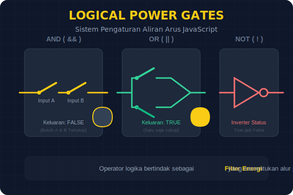

# CH-05: Logical Gates (The Logic Flow)

> **"Logika adalah sistem kecerdasan yang menentukan kapan energi harus mengalir dan kapan harus berhenti."**

Sebuah Hub Energi yang canggih tidak hanya mengalirkan listrik secara buta. Ia harus tahu kapan harus mengaktifkan generator, kapan harus menghemat daya, dan kapan harus memberikan peringatan. Di sinilah kita menggunakan **Operator Perbandingan** dan **Operator Logika**.

## 1. Mental Model: "Sensor & Saklar Otomatis"

Bayangkan Hub Anda dilengkapi dengan sensor pintar:
- **Comparison Sensors (===, !==)**: Memeriksa apakah voltase tepat sesuai standar.
- **Logic Gates (&&, ||)**: Menentukan keputusan kompleks (misal: "JALANKAN generator JIKA baterai rendah DAN panel surya mati").



---

## 2. Sensor Presisi: Comparison Operators

Untuk membandingkan dua nilai energi, kita menggunakan operator perbandingan:

| Operator | Nama | Kegunaan (Contoh) |
| :--- | :--- | :--- |
| `===` | Strict Equal | Apakah daya Benar-benar Sama (Tipe & Nilai)? |
| `!==` | Strict Not Equal | Apakah daya Berbeda? |
| `>`  | Greater Than | Apakah daya melebihi kapasitas? |
| `<`  | Less Than | Apakah daya di bawah ambang batas? |

> [!IMPORTANT]
> **Arsitek Mindset**: Selalu gunakan `===` (Strict Equal) daripada `==` (Loose Equal). `===` memastikan tipe data juga sama, mencegah "kebocoran energi" akibat konversi tipe data otomatis yang membingungkan.

---

## 3. Gerbang Keputusan: Logical Operators

Terkadang, satu kondisi saja tidak cukup. Kita butuh gerbang logika untuk menggabungkan beberapa sensor:

- **AND (`&&`)**: Benar JIKA **SEMUA** kondisi terpenuhi.
- **OR (`||`)**: Benar JIKA **SALAH SATU** kondisi terpenuhi.
- **NOT (`!`)**: Membalikkan status (On jadi Off, Off jadi On).

---

## 4. Quick Switch: Ternary Operator

Untuk keputusan sederhana yang butuh kecepatan, kita menggunakan Ternary Operator sebagai pengganti saklar manual yang panjang:

```javascript
let status = (energy > 20) ? "ACTIVE" : "SAVING_MODE";
```

---

## Hands-on: Sistem Penghematan Otomatis
Buka file `examples/logic_demo.js` untuk melihat bagaimana gerbang logika mengatur distribusi energi di Web Hub.

---
*Status: [status.md](../../../../status.md)*
