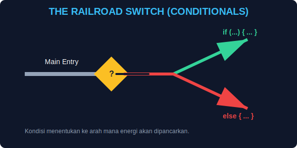

# CH-06: Conditionals (The Multi-Path Circuit)

> **"Kondisional adalah sistem percabangan yang menentukan ke mana energi harus dialirkan berdasarkan kondisi sensor saat ini."**

Dalam bab sebelumnya, kita belajar tentang gerbang logika. Sekarang, kita akan menggunakan gerbang tersebut untuk membangun **Sirkuit Multipath** — sirkuit yang bisa berubah jalur secara dinamis.

## 1. Mental Model: "Saklar Rel Kereta"

Bayangkan aliran energi kita seperti kereta api:
- **`if...else`**: Ibarat saklar di rel kereta yang mengalihkan jalur. Jika jalur A (kondisi) terblokir, kereta beralih ke jalur B.
- **`switch`**: Ibarat stasiun pusat dengan banyak peron (jalur). Kereta akan masuk ke peron yang nomornya tepat sesuai tiket (nilai).



---

## 2. Percabangan Utama: `if`, `else if`, `else`

Ini adalah struktur paling umum untuk membuat keputusan dalam JavaScript:

```javascript
if (energyLevel > 80) {
    // Alirkan ke sektor industri (High Priority)
} else if (energyLevel > 20) {
    // Alirkan ke sektor perumahan (Medium Priority)
} else {
    // Aktifkan mode darurat (Low Energy)
}
```

---

## 3. Multi-Port Hub: `switch` Case

Gunakan `switch` jika Anda memiliki satu variabel yang ingin dibandingkan dengan banyak nilai spesifik secara rapi:

```javascript
switch (sectorType) {
    case "INDUSTRIAL":
        // Prioritas Tinggi
        break;
    case "RESIDENTIAL":
        // Prioritas Menengah
        break;
    default:
        // Sektor lain
}
```

---

## Arsitek Mindset: Hierarki Keputusan

Sebagai arsitek, urutan dalam `if...else if` sangatlah krusial. JavaScript akan mengeksekusi blok pertama yang kondisinya **True** dan mengabaikan sisanya. Pastikan kondisi yang paling spesifik atau mendesak berada di urutan paling atas.

---

## Hands-on: Manajemen Daya Sektor
Buka file `examples/circuit_switch_demo.js` untuk melihat bagaimana kita membangun sirkuit yang mengalihkan energi secara otomatis berdasarkan kebutuhan sektor.

---
*Status: [status.md](../../../../status.md)*
