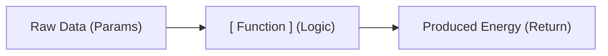

# CH-08: Functions (The Energy Transformers)

> **"Fungsi adalah unit transformer yang dapat digunakan kembali untuk memproses input mentah menjadi output yang berguna."**

Bayangkan Web Hub Anda memiliki banyak kabel dan baterai. Tanpa **Fungsi**, Anda harus menulis ulang sirkuit yang sama setiap kali ingin menghitung daya. Fungsi memungkinkan kita untuk membungkus logika sirkuit ke dalam sebuah "perangkat" yang bisa dipanggil kapan saja.

## 1. Mental Model: "Perangkat Transformer"

Sebuah Fungsi bekerja seperti mesin transformer di gardu listrik:
- **Input (Parameters)**: Energi mentah atau data yang dimasukkan ke mesin.
- **Process (Function Body)**: Logika di dalam mesin untuk mengubah data tersebut.
- **Output (Return Value)**: Energi hasil konversi yang dikeluarkan untuk digunakan bagian lain.



---

## 2. Membangun Transformer: Declaration

Cara standar untuk mendefinisikan transformer:

```javascript
function convertToKilowatt(watt) {
    return watt / 1000;
}
```

- `convertToKilowatt`: Nama perangkat (label).
- `watt`: Slot input (parameter).
- `return`: Gerbang output yang mengirimkan hasil keluar.

---

## 3. Desain Modern: Arrow Functions

Arsitek modern sering menggunakan desain yang lebih ringkas dan hemat ruang yang disebut **Arrow Functions**:

```javascript
const convertToKilowatt = (watt) => watt / 1000;
```

---

## Arsitek Mindset: Modularitas Hub

Jangan membangun satu mesin raksasa yang melakukan segalanya. Bangunlah banyak fungsi kecil yang masing-masing memiliki satu tanggung jawab (Single Responsibility). Misalnya, satu fungsi untuk menghitung pajak energi, satu lagi untuk memformat laporan teks. Ini memudahkan pemeliharaan sirkuit Hub Anda.

---

## Hands-on: Mengoperasikan Transformer
Buka file `examples/transformer_demo.js` untuk melihat bagaimana kita membuat dan memanggil berbagai transformer energi.

---
*Status: [status.md](../../../../status.md)*
