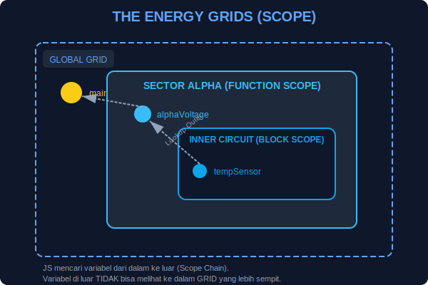

# CH-01: Scope & Visibility (The Reach of Energy)

> **"Scope menentukan sejauh mana energi (data) Anda dapat mengalir dan siapa saja yang memiliki izin untuk memanfaatkannya."**

Dalam sebuah Hub Energi, tidak semua kabel terhubung ke semua perangkat. Ada energi yang bersifat **Global** (tersedia untuk seluruh kota) dan ada energi yang bersifat **Lokal** (hanya tersedia di dalam gedung tertentu). Dalam JavaScript, ini disebut **Scope**.

## 1. Mental Model: "Jaringan Listrik Global & Lokal"

- **Global Scope**: Ibarat Pembangkit Listrik Pusat. Semua gedung dan rumah bisa menarik energi dari sini.
- **Function/Local Scope**: Ibarat Genset di dalam ruangan. Lampu di luar ruangan tidak bisa menyala menggunakan energi dari genset di dalam ruangan tertutup.
- **Shadowing**: Saat variabel di dalam GRID lokal memiliki nama yang sama dengan variabel di GRID global, variabel lokal akan "membayangi" atau menutupi variabel luar.



---

## 2. Jangkauan Global (Global Scope)

Variabel yang dideklarasikan di luar fungsi atau blok apa pun. Bisa diakses dari mana saja.

```javascript
const globalPower = "100kW"; // Pembangkit Pusat

function checkCity() {
    console.log(globalPower); // Bisa diakses!
}
```

---

## 3. Jangkauan Lokal (Local/Function Scope)

Variabel yang dideklarasikan di dalam fungsi. Tersembunyi dari dunia luar.

```javascript
function roomA() {
    const localLamp = "ON"; // Hanya di gedung A
}

console.log(localLamp); // ERROR! Kabel tidak sampai ke sini.
```

---

## 4. Jangkauan Blok (Block Scope)

Khusus untuk `let` dan `const` yang dideklarasikan di dalam `{}` (seperti `if` atau `for`).

```javascript
if (true) {
    let secretEnergy = "Hidden";
}
console.log(secretEnergy); // ERROR! Terkunci di dalam blok if.
```

---

## Arsitek Mindset: Keamanan Energi

Sebagai arsitek, hindari menaruh terlalu banyak variabel di **Global Scope**. Ini disebut "Polluting the Global Scope". Jika semua energi bersifat global, risiko tabrakan (kabel korslet/nama variabel sama) akan sangat tinggi. Gunakan Local dan Block scope sesering mungkin untuk menjaga keamanan sistem Anda.

---

## Hands-on: Eksperimen Visibilitas
Buka file `examples/scope_demo.js` untuk melihat bagaimana variabel menghilang dan muncul berdasarkan lokasinya di sirkuit.

---
*Status: [status.md](../../../../status.md)*
