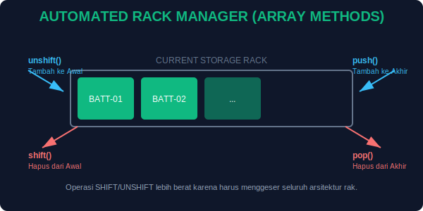

# CH-04: Array Methods (The Automated Rack Manager)

> **"Sebuah Rak Baterai yang efisien tidak dikelola secara manual. Kita menggunakan sistem otomasi untuk menambah, mengambil, dan mengatur posisi setiap unit energi."**

Dalam bab sebelumnya, kita belajar cara menyimpan daftar dalam **Array**. Sekarang, kita akan mempelajari instruksi otomatis (Methods) untuk mengelola isi rak tersebut dengan cepat dan presisi.

## 1. Mental Model: "Automated Rack Manager"

Bayangkan Anda memiliki robot pengelola rak:
- **`push()`**: Robot mendorong baterai baru ke **akhir** rak.
- **`pop()`**: Robot mengambil satu baterai dari **akhir** rak.
- **`unshift()`**: Robot menyisipkan baterai baru ke **depan** rak (menggeser yang lain).
- **`shift()`**: Robot mengambil baterai dari **depan** rak.
- **`splice()`**: Robot melakukan operasi bedah — mengambil atau menaruh baterai di **tengah** rak.



---

## 2. Operasi Ujung Rak (Push & Pop)

Ini adalah cara yang paling sering digunakan untuk menambah atau mengurangi stok energi:

```javascript
const batteryRack = ["Bat-1", "Bat-2"];

batteryRack.push("Bat-3"); // Rak sekarang: ["Bat-1", "Bat-2", "Bat-3"]
batteryRack.pop();         // Rak kembali menjadi: ["Bat-1", "Bat-2"]
```

---

## 3. Operasi Pangkal Rak (Unshift & Shift)

Hati-hati: Operasi ini mengganti nomor antrean (indeks) semua baterai di belakangnya.

```javascript
batteryRack.unshift("Newest-Bat"); // Jadi yang pertama di rak
batteryRack.shift();               // Menghapus yang pertama
```

---

## 4. Operasi Presisi: `splice()` & `indexOf()`

- **`indexOf()`**: Menemukan di nomor slot (indeks) berapa sebuah baterai berada.
- **`splice()`**: Menghapus atau menambah di posisi spesifik.

```javascript
const pos = batteryRack.indexOf("Bat-2");
batteryRack.splice(pos, 1, "Replaced-Bat"); // Ganti Bat-2 dengan Replaced-Bat
```

---

## Arsitek Mindset: Manajemen Beban

Sebagai arsitek, pilihlah metode yang paling efisien. Menggunakan `push` dan `pop` biasanya lebih cepat bagi komputer daripada `shift` dan `unshift` karena komputer tidak perlu menomori ulang seluruh isi rak yang tersisa. Kelolalah "Rak Baterai" Anda dengan bijak!

---

## Hands-on: Simulator Rak Otomatis
Buka file `examples/rack_manager_demo.js` untuk melihat bagaimana robot manager kita mengelola stok energi secara dinamis.

---
*Status: [status.md](../../../../status.md)*
