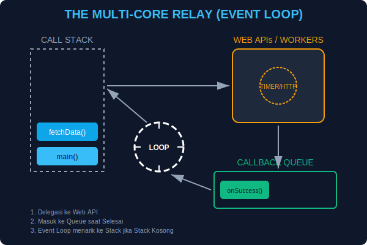

# CH-01: Intro to Async (The Traffic Jam)

> **"Sebuah Hub yang efisien tidak akan membiarkan seluruh kota mati lampu hanya karena satu petugas sedang sibuk mencatat inventaris baterai."**

JavaScript secara bawaan adalah **Single-Threaded** (Hanya punya satu petugas). Jika petugas tersebut sibuk mengerjakan tugas berat yang memakan waktu lama, ia tidak bisa mengerjakan tugas lain. Fenomena ini disebut **Blocking** atau "Kemacetan Lalu Lintas".

## 1. Mental Model: "Sirkuit Sinkron vs Asinkron"

- **Synchronous (Sinkron)**: Ibarat antrean satu jalur di loket pembayaran. Jika orang paling depan memiliki urusan yang sangat lama, semua orang di belakangnya harus menunggu diam tanpa bisa melakukan apa-apa.
- **Asynchronous (Asinkron)**: Ibarat sistem pesan singkat atau alarm. Anda memberikan perintah ("Tolong isi daya baterai ini"), lalu Anda **pernah meninggalkannya** untuk mengerjakan tugas lain. Saat baterai selesai diisi, sebuah alarm akan berbunyi (Callback/Event) untuk memberi tahu Anda.



---

## 2. Masalah: Blocking Code (Kemacetan)

Saat kita menjalankan fungsi yang sangat berat secara sinkron:

```javascript
console.log("Mulai Sistem...");
heavyTask(); // Memakan waktu 10 detik secara sinkron
console.log("Sistem Selesai!"); // Harus menunggu 10 detik untuk muncul!
```

Selama 10 detik tersebut, browser/sistem akan membeku (*freeze*). Klik tombol tidak akan merespons, animasi akan berhenti.

---

## 3. Solusi: Aliran Asinkron (Non-Blocking)

JavaScript memiliki mekanisme **Event Loop** yang memungkinkan petugas kita mendelegasikan tugas berat ke sistem latar belakang (seperti browser API), lalu segera kembali melayani perintah berikutnya.

---

## Arsitek Mindset: Responsivitas Grid

Sebagai arsitek, jangan pernah membiarkan Hub Anda membeku. Setiap kali Anda berhadapan dengan tugas yang durasinya tidak pasti (seperti *fetching data*, *reading files*, atau *timers*), gunakanlah pola asinkron. Ini akan menjaga sistem Anda tetap gesit dan responsif terhadap sinyal pengguna kapan saja.

---

## Hands-on: Simulator Kemacetan
Buka file `examples/traffic_jam_demo.js` untuk melihat secara nyata bagaimana kode yang berat bisa menghentikan seluruh detak jantung sistem jika tidak ditangani dengan benar.

---
*Status: [status.md](../../../../status.md)*
