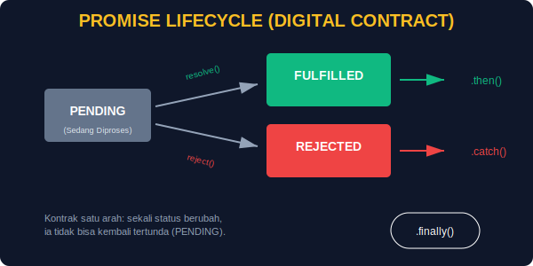

# CH-03: Promises (The Digital Contract)

> **"Katakan selamat tinggal pada catatan pengingat yang berantakan. Gunakan Kontrak Digital (Promise) yang memberikan kepastian: tugas Anda akan selesai dengan sukses, atau Anda akan segera diberitahu jika terjadi kegagalan."**

Callback memiliki banyak kelemahan, terutama saat tugas menjadi kompleks. **Promise** hadir sebagai solusi modern untuk menstandarisasi hasil dari proses asinkron.

## 1. Mental Model: "Kontrak Digital" (Contract)

Bayangkan Anda memesan pasokan energi dari pusat:
- **Pending (Menunggu)**: Kontrak baru saja ditandatangani, energi sedang dikirim. Anda belum tahu sukses atau gagal.
- **Fulfilled (Berhasil)**: Energi sampai dengan selamat. Janji ditepati!
- **Rejected (Gagal)**: Kabel terputus atau stok habis. Janji gagal, tapi Anda mendapatkan laporan alasannya.



## 2. Membuat Kontrak (Creating a Promise)

```javascript
const energyContract = new Promise((resolve, reject) => {
    let isSuccess = true; // Simulasi kondisi sistem
    if (isSuccess) {
        resolve("Energi Terkirim!"); // Menandai Fulfilled
    } else {
        reject("Gangguan Jaringan!"); // Menandai Rejected
    }
});
```

## 3. Menangani Hasil (Consuming a Promise)

Kita menggunakan metode khusus untuk menangani setiap status:
- **`.then()`**: Dijalankan jika statusnya **Fulfilled**.
- **`.catch()`**: Dijalankan jika statusnya **Rejected**.
- **`.finally()`**: Selalu dijalankan di akhir, apapun hasilnya (untuk pembersihan sistem).

```javascript
energyContract
    .then((msg) => console.log("Sukses:", msg))
    .catch((err) => console.error("Error:", err))
    .finally(() => console.log("Operasi Selesai."));
```

## 4. Chaining (Rantai Kontrak)

Kehebatan Promise adalah kemampuannya dirangkai secara linear. Output dari `.then()` pertama bisa menjadi input untuk `.then()` berikutnya. Tidak ada lagi piramida callback!

---

## Arsitek Mindset: Standarisasi Keamanan

Sebagai arsitek, beralihlah ke kontruksi berbasis Promise. Ini memberikan alur penanganan kesalahan (*Error Handling*) yang jauh lebih bersih dan terpusat. Dengan Promise, Hub Anda akan memiliki sistem pelaporan gangguan yang lebih andal dan mudah didebug.

---

## Hands-on: Kontrak Pengisian Baterai
Buka file `examples/energy_promise_demo.js` untuk melihat bagaimana Promise mengelola proses pengisian daya baterai yang tak menentu secara profesional.

---
*Status: [status.md](../../../../status.md)*
