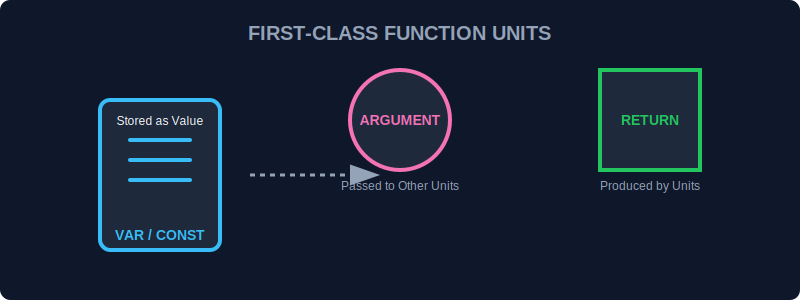

# CH-01: First-class Functions (Energy Units)

> **"Di JavaScript, fungsi adalah 'Unit Energi' mandiri yang bisa disimpan dalam baterai (variabel), dikirim melalui kabel (argumen), atau dihasilkan oleh generator lain (return value)."**

Kemampuan JavaScript untuk memperlakukan fungsi seperti data biasa adalah rahasia di balik fleksibilitasnya yang luar biasa.

## 1. Mental Model: "Energy Units"

Bayangkan fungsi bukan sekadar instruksi yang tertulis di dinding, tapi sebuah **Unit Fisik** (seperti modul baterai) yang bisa Anda masukkan ke dalam tas dan dibawa ke mana saja.

Tiga pilar "First-class Citizens":
1.  **Dapat Disimpan**: Bisa dimasukkan ke variabel.
2.  **Dapat Dikirim**: Bisa menjadi input untuk fungsi lain.
3.  **Dapat Dikembalikan**: Bisa menjadi output dari fungsi lain.



---

## 2. Fungsi sebagai Data (Function Expressions)

Anda tidak harus selalu memberi nama permanen pada fungsi. Anda bisa menyimpannya dalam variabel:

```javascript
const transformEnergy = function(input) {
    return input * 0.85; // Efisiensi 85%
};

console.log(transformEnergy(100)); // Output: 85
```

---

## 3. Fungsi sebagai Pengantar (Callbacks)

Karena fungsi adalah unit yang bisa dipindah, Anda bisa mengirim "instruksi kerja" ke modul lain.

```javascript
function processGrid(callback) {
    console.log("Memulai pemrosesan grid...");
    callback();
}

const alertSystem = () => console.log("Grid diproses!");

processGrid(alertSystem); 
```

---

## 4. Fungsi sebagai Produk (Higher Order Returns)

Generator dapat menghasilkan generator lain. Ini adalah fondasi dari pola desain fungsional yang kuat.

```javascript
function createMultiplier(factor) {
    return function(value) {
        return value * factor;
    };
}

const doublePower = createMultiplier(2);
console.log(doublePower(50)); // Output: 100
```

---

## Arsitek Mindset: Fleksibilitas Moduler

Dengan memperlakukan fungsi sebagai "Unit Energi", Anda bisa membangun sistem yang sangat dinamis. Anda tidak perlu membuat ribuan fungsi spesifik; cukup buat beberapa fungsi umum yang bisa menerima "unit instruksi" (callback) yang berbeda-beda untuk melakukan tugas yang berbeda di dalam grid Anda.

---

## Hands-on: Pabrik Transformator
Buka file `examples/functions_lab.js` untuk melihat bagaimana kita membangun sistem pengolah data yang modular menggunakan fungsi sebagai unit utama.

---
*Status: [status.md](../../../status.md)*
