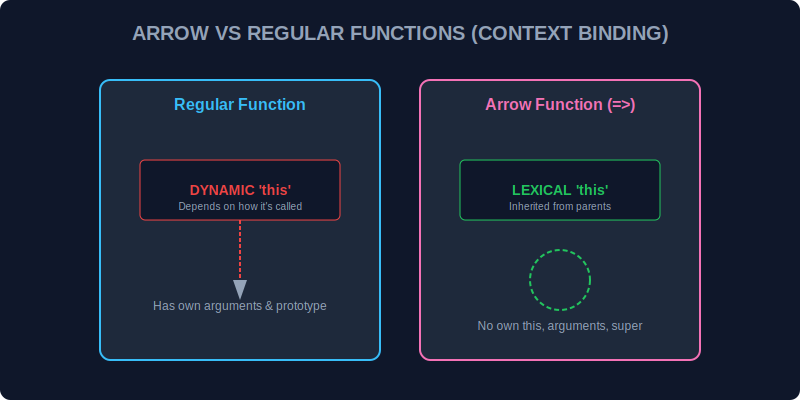

# CH-02: Arrow vs Regular Functions (The Switch Core)

> **"Meskipun keduanya terlihat seperti saklar fungsi, Arrow Function dan Regular Function memiliki 'Inti Saklar' yang berbeda, terutama dalam cara mereka menangani sumber tenaga (`this`)."**

Memilih antara `function()` dan `=>` bukan hanya soal selera gaya penulisan (*syntactic sugar*), tapi soal bagaimana fungsi tersebut berinteraksi dengan lingkungannya.

## 1. Mental Model: "The Switch Core"

Bayangkan dua jenis saklar di Hub Energi kita:
1.  **Regular Switch (Regular Function)**: Memiliki detektor energi sendiri. Ia akan menyesuaikan diri dengan "siapa pun yang menekan saklar tersebut" pada saat itu.
2.  **Arrow Switch (Arrow Function)**: Tidak punya detektor sendiri. Ia selalu menggunakan pengaturan energi dari ruangan tempat ia dipasang (Lexical Scope).



---

## 2. Perbedaan Utama: Sumber Daya (`this`)

### A. Regular Function: Dinamis
`this` ditentukan oleh **bagaimana** fungsi dipanggil.
```javascript
const hub = {
    name: "Main Hub",
    status: function() {
        console.log(`System: ${this.name}`);
    }
};
hub.status(); // Output: System: Main Hub
```

### B. Arrow Function: Leksikal
`this` ditentukan oleh **di mana** fungsi didefinisikan. Ia tidak punya `this` sendiri.
```javascript
const hub = {
    name: "Main Hub",
    status: () => {
        console.log(`System: ${this.name}`);
    }
};
hub.status(); // Output: System: undefined (karena 'this' merujuk ke Global/Window)
```

---

## 3. Fitur yang Hilang di Arrow Function

Untuk membuat Arrow Function lebih ringan dan cepat, beberapa komponen "berat" dihilangkan:
- **No `arguments`**: Tidak bisa mengakses objek arguments (gunakan *rest parameters* `...args`).
- **No `constructor`**: Tidak bisa dipanggil dengan `new`.
- **No `prototype`**: Tidak punya properti prototype.

---

## Arsitek Mindset: Memilih Saklar yang Tepat

Sebagai arsitek sirkuit:
- Gunakan **Regular Function** untuk metode objek (*object methods*) di mana Anda butuh akses ke properti objek tersebut melalui `this`.
- Gunakan **Arrow Function** untuk fungsi pendek, pemrosesan array (`map`, `filter`), atau sebagai *callback* di dalam metode objek agar `this` tetap merujuk ke objek utama (menghindari masalah `const self = this`).

---

## Hands-on: Lab Perbandingan Saklar
Buka file `examples/arrow_lab.js` untuk melihat eksperimen langsung bagaimana `this` berperilaku berbeda saat kita menggunakan kedua jenis fungsi ini dalam konteks yang sama.

---
*Status: [status.md](../../../status.md)*
